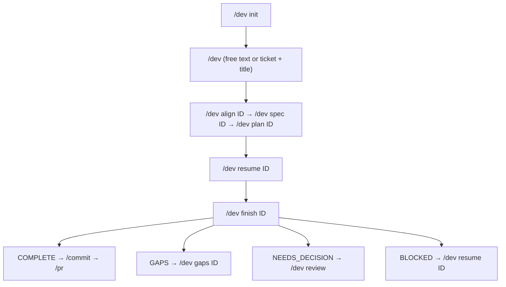

# ACCORD — Single Entry Orchestrator

Every harness flow starts here. Subcommands route to dashboards, queues, or phase agents. All state lives on disk — the user can `/clear` between rounds and resume with `/dev resume <ID>`.

## Workflow

The standard `implement/standard` pipeline. Solid arrows (`-->`) are forward progress; dotted arrows (`....>`) are pauses that halt the orchestrator until the user resumes.

```
  /dev <desc>
       |
       v
  phase-align    .... needs_gather ...>  [phase-gather]  (delegated, transparent)
       |         .... needs_input ....>  checkpoint  -->  /dev resume <ID>
       |
  done |  (produces docs/dev/<ID>/brief.md — grounds all downstream phases)
       v
  phase-spec     .... needs_input ....>  checkpoint  -->  /dev resume <ID>
       |
  done |
       v
  phase-plan     .... needs_input ....>  checkpoint  -->  /dev resume <ID>
       |
  done |
       v
  .--> phase-test   (write tests, confirm RED)
  |      |
  |      v
  |    review-test  (advisory — pre-impl mode)
  |      |
  |      v
  |    phase-code   (implement, make tests GREEN)
  |      |
  |      v
  |    [review-code] (conditional — challenge tasks / request_review)
  |      |
  | done |
  |      v
  '---- more tasks? -- yes
              |
              | no
              v
  /dev finish <ID>
              |
              v
  review queue clean? --> no --> NEEDS_DECISION (/dev review)
              |
             yes
              v
  verify preflight + phase-verify-acceptance
              |
              +-- pass --> COMPLETE (/commit -> /pr)
              |
              '-- gaps --> GAPS (/dev gaps <ID>)
```

Other patterns collapse this pipeline:
- `implement/express` skips align + spec + plan — goes `gather -> code -> verify-code -> report`.
- `quick_fix` skips align/spec/plan — goes `[test -> review-test] -> code -> verify-code -> report` (test/review-test only when strategy is `new_red_test`).
- `investigate`, `infra`, `analyse` each run their own pipeline (see §Subcommand: (default) Step 3).

> **Schema injection is automatic.** The ACCORD extension injects relevant schemas per agent via the agent registry (`src/core/agents/registry.ts` → `schemas/`). The orchestrator never reads schema files directly.

## Runtime architecture

This skill runs inside **pi** with the following extensions pre-loaded:

| Extension | What it does |
| --- | --- |
| `subagent` | Provides the `subagent` tool — spawns isolated `pi` processes per agent |
| `ACCORD` | Transparent hooks — JSON schema validation on `.tasks/`/`docs/` writes, usage tracking (subagent + main orchestrator `turn_end`), return-packet validation, verify preflight checks (staleness + full verification_commands), post-code verification (type_check + test after every phase-code), config guard (blocks agents if AGENTS.md ACCORD config missing), brief injection (appends ## Project Stack to every subagent brief), pending-decision notifications, status bar, ACCORD config loading from AGENTS.md. On first billable usage for a work item, writes `.tasks/.harness-run.json` with `tag` = work item id and `auto: true` unless you set `/dev tag` or `DEV_HARNESS_RUN_*`. Also persists a `dev-harness-run` entry into Pi session state (`appendEntry`) when a run id/tag exists so harness sessions surface in Pi session replay / analytics alongside raw chat. |
| `notify` | Native terminal notification when pi is idle |

**You do not call hooks or validation scripts manually.** The extensions fire automatically on every subagent result and every file write. Your only job is to use the `subagent` tool to spawn agents and read/write `.tasks/` and `docs/` files — the extensions handle validation, cost tracking, verification, and notifications behind the scenes.

**Project configuration:** The ACCORD extension reads the `## Dev Harness` compatibility JSON block from the project's `AGENTS.md` at session start (and auto-refreshes on AGENTS.md writes). This config provides the project's verification commands, test runner, type-check command, lint command, and test file patterns. If absent, subcommands that need stack-specific commands (`spec`, `plan`, `resume`, `finish`, `check`) will be blocked by the extension: `No ACCORD config found. Run /dev init to configure.` The `help`, `init`, `tasks`, and `review` subcommands work without config.

**Extension-driven verification:** The extension runs verification commands deterministically at phase boundaries — agents do not decide when to verify:
- **After every `phase-code` completion:** Runs `type_check` (hard gate — blocks next task on failure) + `test.command` (advisory — results injected for the orchestrator to act on).
- **Before every `phase-verify-*` spawn:** Runs full `verification_commands` array. Blocks if all commands fail. Injects results into the verify agent's brief so it has real preflight data.
- Agents still receive verification results in their context and can self-correct on advisory failures.

## Context budget

Hard rule: your working context is the work item JSON (~1 KB) + N agent summaries (~1–2 KB each). Do not read source files, spec/plan/verify bodies, or test output in this skill's context. Delegate to agents.

## Orchestrator tools

The ACCORD extension registers deterministic tools that handle all file I/O, data transforms, and formatting. **Use these instead of reading/writing JSON files manually:**

| Tool | Replaces | What it does |
| --- | --- | --- |
| `dev_tasks` | Glob + parse + format dashboard | Returns formatted work item dashboard |
| `dev_intent` | Ad hoc intent guessing | Deterministically recommends `intent_mode`, confidence, escalation ceiling, target paths |
| `dev_intent_enrich` | Ticket-aware intent refinement | Refines a `dev_intent` recommendation using ticket metadata (AC count, story points, subtasks, description length). Call after fetching ticket when confidence is medium/low. |
| `dev_bootstrap` | Manual JSON construction | Creates a validated work item with correct entry phase and optional intent contract |
| `dev_checkpoint` | Read/write/delete checkpoint files | Manages multi-turn checkpoint state |
| `dev_review_queue` | Glob + parse + collect decisions | Returns sorted pending decisions + deviations |
| `dev_retro` | Manual session spelunking | Analyses pi-insights + harness session markers for shift-left opportunities |
| `dev_finalize` | Manual terminal-state edits | Persists terminal outcome, next action, retro summary, and shift-left findings on the work item |
| `dev_promote_events` | Read task file + iterate events + update WI | Promotes escalations → decisions, deviations, review requests |
| `dev_spec_gaps` | Read spec + 10-point checklist | Runs all 10 checks deterministically, returns formatted results |
| `dev_code_brief` | Read spec + plan + assemble brief | Returns the complete phase-code brief with nonce, ACs, guidance |
| `dev_quick_fix_brief` | Create quick_fix task state + mini contract + assemble brief | Creates `.tasks/<ID>-task-1.json`, persists `task_ids`, and returns a phase-code brief with `quick_fix_contract.plan` + `quick_fix_contract.test` |
| `dev_resume_state` | Read WI + checkpoint + determine phase | Returns phase, checkpoint status, pattern for routing |
| `dev_transition` | Read-modify-write WI + delete checkpoint | Atomic phase transition with artifact path updates (spec, plan, verify, brief) |
| `dev_verify_summary` | Parse verify report + render Markdown | Writes `verify.md`; returns verdict, per-AC counts, gaps, formatted summary |
| `dev_nonce` | `openssl rand -hex 3` | Generates a 6-char hex nonce |
| `dev_decision_packet` | Format pattern-specific summary | Builds decision packet with pending count |
| `dev_init_detect` | Manual file scanning + inference | Detects stack, infers commands, resolves config placement — returns full proposal |
| `dev_init_write` | Manual markdown construction + file write | Writes config to AGENTS.md (local, root, root_replace, link_only) |

**Rules for tool usage:**
- Call `dev_intent` before classifying any free-text default request. Respect `needs_confirmation` and `escalation_ceiling` before spawning heavy phases.
- Prefer `dev_bootstrap` over manual `Write` to `.tasks/` — it validates the schema and persists the intent contract.
- Prefer `dev_transition` over manual `Edit` of `phase` + `spec`/`plan`/`verify` — it's atomic with checkpoint cleanup.
- Call `dev_finalize` at the end of verify/report/retro so terminal outcome and next action are saved on `.tasks/<ID>.json`.
- Prefer `dev_code_brief` over reading spec/plan JSON in orchestrator context — keeps context clean.
- Prefer `dev_promote_events` after every `phase-code` result — it handles all event types.
- Prefer `dev_checkpoint` over manual Read/Write/Delete of checkpoint files.
- Use `dev_tasks`, `dev_review_queue`, `dev_retro`, `dev_spec_gaps` for read-only operations — never parse these JSONs manually. Use `dev_verify_summary` after verify to render `verify.md` and summarize `verify.json`.

## Subcommand dispatch

Parse the first word of the user's input. The subcommand map is exhaustive:

| First word | Route |
| --- | --- |
| `init` | §Subcommand: init — detect project stack, write AGENTS.md ACCORD config |
| `align <ID>` | §Subcommand: align — multi-turn `phase-align` problem framing |
| `spec <ID>` | §Subcommand: spec — multi-turn `phase-spec` interview |
| `plan <ID>` | §Subcommand: plan — multi-turn `phase-plan` construction |
| `resume <ID>` | §Subcommand: resume — read work item, continue at `phase` |
| `finish <ID>` | §Subcommand: finish — deterministic post-implementation closeout |
| `check <ID>` | §Subcommand: check — lower-level acceptance checks |
| `gaps <ID>` | §Subcommand: gaps — two-round `phase-gaps` Jira creation |
| `review` | §Subcommand: review — batch-answer pending decisions |
| `deviations <ID> [accept \| revert] [task_id]` | §Subcommand: deviations — surface or resolve `review-deviation` blockers |
| `amend-spec <ID>` | §Subcommand: amend-spec — dated amendment flow for mid-implementation spec changes |
| `spec-gaps <ID>` | §Subcommand: spec-gaps — run the common-gap checklist against a finalised spec |
| `tasks` | §Subcommand: tasks — dashboard over `.tasks/*.json` |
| `retro` | Run `dev_retro` and present the formatted retrospective |
| `tag` | Label this session for usage analytics |
| `help` (or `-h`, `--help`, `?`) | §Subcommand: help — print this table + examples |
| _(empty)_ | §Subcommand: (default) — see "Empty input" below |
| anything else | §Subcommand: (default) — classify pattern, bootstrap work item, dispatch |

Mismatched subcommand + arguments (e.g. `spec` without `<ID>`) → ask for the missing piece. Never guess the work item ID.

**Empty input** (`/dev` with no args): handled deterministically by the extension's `/dev` command handler. It calls `dev_dispatch` which:
- Zero work items → displays help.
- One work item → suggests `/dev resume <ID>` (show title + phase); does not auto-resume.
- Multiple work items → displays the `dev_tasks` dashboard.

Never dispatch to classify-and-bootstrap on empty input — the user has not described anything yet. The extension handles this before the skill is invoked.

---

## Subcommand: help

Render the subcommand table from §Subcommand dispatch (this file is the single source — do not retype, read the markdown table and reformat for the terminal) plus a short examples block. Do not spawn agents, do not read work item state.

Template:

```
/dev — agentic harness entry point
```



```
Optional: /dev check ID reruns lower-level acceptance checks.

Subcommands:
  init                    Detect stack & write AGENTS.md ACCORD config
  align <ID>              Multi-turn collaborative problem framing
  spec <ID>               Multi-turn spec interview
  plan <ID>               Multi-turn plan construction
  resume <ID>             Continue a work item at its current phase
  finish <ID>             Verify, summarize, and finalize after implementation
  check <ID>              Run acceptance checks only
  gaps <ID>               Create Jira tickets for verify gaps
  review                  Answer pending decisions (batch)
  deviations <ID>         Surface or resolve implementation deviations
  amend-spec <ID>         Amend the spec during implementation
  spec-gaps <ID>          Run the spec gap checklist
  tasks                   Dashboard of active work items
  retro                   Analyse harness sessions for shift-left improvements
  tag                     Label this session for usage analytics
  help                    Show this help
  <free text>             Classify pattern, bootstrap work item, dispatch

Examples:
  /dev                              list active work or show this help
  /dev init                         configure harness for this project
  /dev ACCORD-1234 add refresh tokens start a new implement/standard work item
  /dev align ACCORD-1234            collaborative problem framing
  /dev spec ACCORD-1234             resume the spec interview
  /dev plan ACCORD-1234             generate the implementation plan
  /dev resume ACCORD-1234           continue at the work item's phase
  /dev finish ACCORD-1234           verify, summarize, and finalize after implementation
  /dev check ACCORD-1234            rerun lower-level acceptance checks
  /dev gaps ACCORD-1234             create tickets for verify gaps

State lives in .tasks/ (runtime) and docs/dev/<ID>/ (committed).
Safe to /clear between rounds — resume with /dev resume <ID>.
```

Stop after printing. Read-only.

---

## Subcommand: init — detect project stack, write AGENTS.md ACCORD config

Configures the harness for the current project's tech stack. The `dev_init_detect` tool does all scanning, inference, and config placement resolution deterministically. The LLM's job is limited to: presenting results, asking interactive questions, applying corrections, and calling `dev_init_write`.

### Step 1 — Detect

Call the `dev_init_detect` tool (no args — it uses cwd). It returns:

| Field | What it contains |
|---|---|
| `proposed_config` | Full `DevHarnessConfig` inferred from project files. `null` if no project found. |
| `placement` | Config placement resolution: `at_root`, `root_exists`, `root_no_config`, or `root_no_agents`. Includes `git_root`, `root_agents_md`, and `existing_root_config` (when root already has config). |
| `global_context_sources` | Enabled sources from `~/.config/pi/agent/accord.json`. |
| `detection_notes` | Human-readable list of what was detected and why. |
| `formatted_summary` | Pre-rendered summary ready to show the user (includes placement options + diff against existing root config). |

If `proposed_config` is `null` → print the `formatted_summary` (it contains the "no project files" message). Stop.

### Step 2 — Resolve config placement

Read `placement.type` from the detect result. Present the appropriate choice to the user:

| `placement.type` | Prompt | `dev_init_write` target |
|---|---|---|
| `at_root` | No choice needed — config goes to cwd's AGENTS.md. | `"local"` |
| `root_exists` | **"Root AGENTS.md already has ACCORD config. [L]ink to it, [O]verride with a local config, or [R]e-detect and replace root config?"** | L→`"link_only"`, O→`"local"`, R→`"root_replace"` |
| `root_no_config` | **"Write ACCORD config to repo root AGENTS.md? [y/n]"** | y→`"root"`, n→`"local"` |
| `root_no_agents` | **"Create AGENTS.md with ACCORD config at repo root? [y/n]"** | y→`"root"`, n→`"local"` |

If user chose `[L]ink`, skip Steps 3–5 — go straight to Step 6 with `target: "link_only"`.

Store the chosen `target` for Step 6.

### Step 3 — Configure context sources (interactive)

If `global_context_sources` is non-empty, ask the user for project-level scoping:

- **Slack**: "Scope to specific channels? (e.g. #eng-backend)" → add `channels` array
- **Confluence**: "Space key? Labels?" → add `space` + `labels`
- **Google Docs**: "Google Drive folder ID?" → add `folder_id`

Let the user disable unwanted sources: `{ "type": "slack", "enabled": false }`.

Only add `context_sources` to the config if the user provides project-specific scoping or disables a source. If using globals as-is, omit the field (merge logic handles it at runtime).

If tracker was not detected (`proposed_config.tracker` is absent), ask: "Issue tracker? [jira/github/gitlab/plain-text]" and "Project prefix? (e.g. STEP)". Set `tracker` on the config.

### Step 4 — Confirm with user

Present the `formatted_summary` from Step 1. Ask:

```
Confirm? Or provide corrections (e.g. "test should be make test", "add lint: biome check").
```

If the user provides corrections:
1. Apply them to `proposed_config` (modify the JSON fields directly).
2. Re-present the changed fields and ask to confirm again.

Do not re-run detection — just amend the proposed config object.

### Step 5 — Handle root_replace diff confirmation

Only when `target` is `"root_replace"`: check `placement.existing_root_config` from the detect result. The `formatted_summary` already includes a diff. Ask:

```
Replace root ACCORD config with these changes? [y/n]
```

On `n`, fall back to `target: "local"` (write to cwd only).

### Step 6 — Write

Call `dev_init_write` with:
- `config`: the finalised config (with any user corrections from Step 4 + context sources from Step 3)
- `target`: the resolved target from Step 2 (possibly changed in Step 5)
- `cwd`: current working directory
- `git_root`: `placement.git_root` from the detect result (required when target ≠ `"local"`)

The tool handles:
- Creating/updating AGENTS.md files
- Inserting/replacing the `## Dev Harness` section
- Writing `dev_harness_ref` directives for linked configs
- Returning a human-readable summary

Print the tool's `summary` to the user. Stop.

The ACCORD extension auto-refreshes its cached config when AGENTS.md is written — no restart required.

---

## Subcommand: (default) — classify and dispatch

### Step 1 — Recommend intent, then classify the request

Call `dev_intent` with the user's free-text input before choosing a pattern. Treat its output as the intent contract for this run:

| intent_mode | Default handling |
| --- | --- |
| `narrow_change` | `quick_fix`; no full pipeline unless the user confirms |
| `pipeline` | `implement/standard` unless the user requested `express` or `orchestrated` |
| `review` | Review-only; do not edit or implement unless the user confirms |
| `commit` | Hand off to the commit workflow; do not bootstrap a work item |
| `explain` | Answer/analyse; no edits |
| `investigate` | Read-only diagnosis first; edits require confirmation or a pending decision |

#### Step 1a — Ticket enrichment (conditional)

If **all three** conditions are met, enrich the recommendation with ticket metadata:

1. `dev_intent` returned `confidence` of `medium` or `low`
2. The user's input contains a ticket ID (`[A-Z]+-\d+` or `#\d+`)
3. The `intent_mode` is `pipeline` or `narrow_change` (the two modes where scope matters most)

Enrichment procedure:

1. Fetch the ticket using the appropriate tracker tool (e.g. `getJiraIssue`). Extract:
   - `issue_type` — the issue type name (Bug, Story, Task, Epic)
   - `story_points` — the story point estimate (if set)
   - `ac_count` — count of acceptance criteria (count checkbox items or bullet points under an "Acceptance Criteria" heading in the description; 0 if none)
   - `description_length` — character count of the description body
   - `subtask_count` — number of subtasks
   - `linked_issue_count` — number of linked issues
2. Call `dev_intent_enrich` with the original `dev_intent` recommendation and the extracted `ticket_signals`.
3. If the result has `changed: true`, use the `refined` recommendation as the intent contract going forward. Tell the user what changed and why, e.g.: `Ticket PROJ-123 has 5 ACs and 3 story points — upgrading from quick_fix to implement/standard.`
4. If the result has `changed: false`, continue with the original recommendation.

If the ticket fetch fails (auth error, not found), skip enrichment silently and continue with the original `dev_intent` result. Do not block the flow.

Respect `needs_confirmation`: if true, ask the user to choose from explicit response tokens before bootstrapping. The prompt MUST include the recommended harness path and at least one bypass/alternate path, for example: `Reply "full-harness" to run ACCORD as implement/standard, "quick-fix" to run the quick_fix harness flow, or "manual" to bypass the harness for a narrow change.` Do not accept bare `yes`/`no`/`ok` replies for these prompts; treat them as ambiguous and ask again with the same explicit choices. For high-confidence recommendations, proceed but include the mode in the brief and `dev_bootstrap` call.

Then derive `pattern` from the recommendation plus the user's input:

| Cue | Pattern | Variant |
| --- | --- | --- |
| `intent_mode=pipeline`, or "add / implement / build / feature" with ticket | `implement` | `standard` (default) |
| same but user says "quick one", "no ceremony" | `implement` | `express` |
| ticket lists 3+ parallelisable tasks and user asks for worktrees | `implement` | `orchestrated` |
| `intent_mode=narrow_change`, or "fix a typo / one-line / rename in file X" | `quick_fix` | — |
| `intent_mode=investigate`, or "why is / what's wrong / investigate / root cause" | `investigate` | — |
| Terraform / Helm / Kubernetes / Pulumi / CloudFormation | `infra` | — |
| "ADR / design doc / write up / compare options" | `analyse` | — |
| `intent_mode=explain` and no artifact requested | `thinking_partner` | — |

**No-ticket flows:** When the user describes work without referencing a ticket (no `[A-Z]+-\d+` or `#\d+` pattern), generate a keyword slug ID (see Step 2) only for modes that create work items (`pipeline`, `narrow_change`, `investigate`, `analyse`). Do not create work items for `commit`, `review`, or pure `explain` unless the user asks to persist the run.

Ambiguous → present the top-2 and ask. Do not guess. Never escalate from `narrow_change`, `review`, `explain`, or `investigate` into `pipeline` unless the user explicitly confirms.

### Step 2 — Bootstrap or resume the work item

Extract the work item ID (`[A-Z]+(-[A-Z]+)*-\d+`). If none present:

- **Ticket-based flows** (user mentions a Jira/GitHub issue) → ask for the ticket ID.
- **No-ticket flows** (user describes work without a ticket reference) → generate a keyword slug. Extract 1–3 uppercase keywords from the description, append `-1`: e.g. "I want to add auth refresh tokens" → `AUTH-REFRESH-1`. If that ID exists in `.tasks/`, increment the suffix (`AUTH-REFRESH-2`). Present the generated ID: `Using AUTH-REFRESH-1. Continue? (or provide a different ID)`.

Call `dev_resume_state` with the ID:

- **Returns state** (work item exists) → Tell the user: `Resuming <ID> at phase <phase>.` If the tool returns an intent contract, restate the ceiling briefly before dispatching. Jump to the phase dispatcher (next step).
- **Returns error** (missing) → Call `dev_bootstrap` with the ID, title, pattern, variant, plus `intent_mode`, `intent_confidence`, `escalation_ceiling`, `target_paths`, `out_of_scope`, and a concise `expected_finish` derived from `dev_intent`. The tool creates a validated work item with the correct entry phase, timestamps, and persisted intent contract. The ACCORD extension validates the JSON schema on write.

### Step 3 — Dispatch by pattern

Pattern composition table:

| Pattern/Variant | Sequence |
| --- | --- |
| `implement/express` | gather → code → verify-code → [review-code] → report |
| `implement/standard` | align\* → spec\* → plan\* → per-task (test → [review-test pre-impl] → code → verify-code → [review-code]) → finish |
| `implement/orchestrated` | align\* → spec\* → plan\* → parallel (test → [review-test] → code) per worktree → sequential merge → finish |
| `quick_fix` | [test → review-test]\*\* → code → verify-code → report |
| `investigate` | gather → explore → hypothesise → test → report |
| `infra` | gather → explore → code (IaC) → verify-infra → report |
| `analyse` | gather → explore → draft (inline — orchestrator assembles the design doc) → review-design → report |
| `thinking_partner` | conversational — no pipeline |

`*` = multi-turn checkpoint phase (see §Multi-turn pattern). `**` = only when `quick_fix_contract.test.strategy` is `new_red_test`; skipped for `existing_tests` and `no_test`. `[review-test pre-impl]` = spawn after every `phase-test` before `phase-code`; advisory, not blocking — critical findings trigger a `phase-test` respawn. `[review-code]` = spawn only when the task has `challenge: true` or `phase-code` emits a `request_review` event.

Entry phases set by `dev_bootstrap` per pattern:

| Pattern | Variant | Entry phase |
| --- | --- | --- |
| `implement` | standard / orchestrated | `speccing` |
| `implement` | express | `implementing` |
| `quick_fix` | — | `fixing` |
| `investigate` | — | `gathering` |
| `infra` | — | `exploring` |
| `analyse` | — | `researching` |

### Phase-to-agent map

Every phase dispatches to a phase agent spawned via the `subagent` tool.

| Phase | Agent |
| --- | --- |
| align | `phase-align` (multi-turn, pipeline entry point — delegates to `phase-gather` when needed) |
| explore | `phase-explore` |
| spec | `phase-spec` (multi-turn) |
| plan | `phase-plan` (multi-turn) |
| test (implement) | `phase-test` (one spawn per task — writes tests in clean context; see §Code loop) |
| test (investigate) | `phase-test` (hypothesis testing — confirms/rejects a hypothesis from `phase-hypothesise`) |
| code | `phase-code` (one spawn per task — implements against tests it didn't write; see §Code loop) |
| verify-code | inline Bash — run the spec's `verification.commands` on the working tree |
| verify-acceptance | `phase-verify-acceptance` |
| verify-infra | `phase-verify-infra` |
| hypothesise | `phase-hypothesise` |
| draft | inline — orchestrator assembles the design doc (analyse pipeline) |
| gaps | `phase-gaps` (two-round — see §Subcommand: gaps) |
| finish | `dev_review_queue` + `dev_tasks` + `phase-verify-acceptance` + `dev_verify_summary` + `dev_finalize` |
| report | inline — §Decision packet |

**How to spawn:** Use the `subagent` tool with `{ agent: "<name>", task: "<brief>" }`. The brief contains the input fields described in each agent's "Expected Input" section, serialised as text. For parallel spawns (e.g. orchestrated code loop), use `{ tasks: [{ agent: "<name>", task: "<brief>" }, ...] }`. For sequential chains, use `{ chain: [...] }`.

The ACCORD extension automatically:
- Validates the agent's return packet against per-agent return schemas (bundled in `schemas/return-schemas/`)
- Extracts usage stats and appends to `.tasks/<ID>-usage.jsonl`
- Recomputes `cost_usd` on the work item
- Appends a validation warning to the result if the return packet is malformed

You do not need to run any validation scripts or cost reconciliation. Just read the subagent's output and act on the `status` field.

### Quick fix loop

Use this path when the work item has `pattern: "quick_fix"` or `phase: "fixing"`.

Quick fixes skip the full interview/spec/plan agents. Instead, `dev_quick_fix_brief` auto-generates lightweight spec and plan stubs from the mini contract so that `dev_code_brief` works and review agents have spec context. When the test strategy is `new_red_test`, `phase-test` and `review-test` run before `phase-code` — preserving the adversarial test/impl separation from the standard pipeline.

1. Call `dev_quick_fix_brief` with `work_item_id`.
   - This auto-generates schema-valid spec and plan stubs at `docs/dev/<ID>/spec.json` and `docs/dev/<ID>/plan.json`, and sets `wi.spec`/`wi.plan` on the work item. The spec contains a single AC derived from `expected_finish`; the plan contains a single task covering that AC.
   - Creates or refreshes `.tasks/<ID>-task-1.json` with the mini contract.
   - Persists `task_ids: [1]` on the work item.
   - Writes `quick_fix_contract.test` with one strategy:
     - `new_red_test` — a separate `phase-test` agent writes the test; `phase-code` then implements against it.
     - `existing_tests` — `phase-code` must run the named existing test command before and after implementation.
     - `no_test` — allowed only when the contract records a reason, typically docs/content/mechanical changes or no configured test command.
   - When strategy is `new_red_test`, the task file is initialised with `phase: "phase-test"` and `pre_impl_gates: "pending"`. The returned brief is a `phase-test` brief (with covered AC and contract context).
   - When strategy is `existing_tests` or `no_test`, the task file is initialised with `phase: "phase-code"` and `pre_impl_gates: "complete"`. The returned brief is a `phase-code` brief generated by `dev_code_brief` (reading the stubs), with the quick fix contract appended.

2. **If strategy is `new_red_test`** (brief type is `phase-test`):
   a. Spawn `phase-test` with the brief returned by `dev_quick_fix_brief`. The brief includes the covered AC, mini contract, target paths, and expected finish — `phase-test` uses these as the "spec" to write a narrow regression test.
   b. Read the return packet:
      - `status: done` → tests written, RED confirmed. Continue to step 2c.
      - `status: stuck` → run §Promote events; emit §Decision packet; halt.
   c. Spawn `review-test` in **pre-impl mode** with the test files from `phase-test`'s return packet. The spec stub at `docs/dev/<ID>/spec.json` gives `review-test` AC coverage context.
   d. Read the return packet:
      - `verdict: clean` → proceed to step 3.
      - `verdict: issues` with **critical** findings → respawn `phase-test` with findings appended. Max 2 respawns — after that, proceed with a warning.
      - `verdict: issues` with only warnings/suggestions → proceed.
   e. Update the task file: set `phase: "phase-code"`, `pre_impl_gates: "complete"`, persist `test_files` and `red_confirmed`.

3. **Assemble the phase-code brief**: Call `dev_code_brief` with `work_item_id` and `task_id: "1"`. This reads the spec/plan stubs and produces a standard code brief. Spawn `phase-code` with the returned brief.
4. Read the return packet. The ACCORD extension has validated it and run post-code verification.
5. Always call `dev_promote_events` with `task_id: "1"` after the `phase-code` result.
6. Process:
   - `status: done` and no hard-gate verification failure → call `dev_transition` with `next_phase: "complete"`, then call `dev_finalize` with `terminal_outcome: "done"` and `next_action: "/commit"`.
   - `status: stuck` or hard-gate verification failure → leave phase as `fixing`, call `dev_decision_packet`, and stop.
   - `status: blocked` → call `dev_transition` with `next_phase: "blocked"` and emit a decision packet.

The quick-fix path must leave state files and artifact stubs usable after every run:

- `.tasks/<ID>.json` has `pattern: "quick_fix"`, `phase`, `task_ids: [1]`, `spec`, and `plan`.
- `.tasks/<ID>-task-1.json` has matching `owner_nonce`, `phase`, `pre_impl_gates`, `quick_fix_contract`, and final `status`.
- `docs/dev/<ID>/spec.json` and `docs/dev/<ID>/plan.json` exist and pass schema validation.

### Code loop

For each task in the plan with per-task status `pending`:

#### Phase 1 — Write tests (phase-test)

1. **Assemble test brief** — Call `dev_code_brief` with `work_item_id` and `task_id`. It reads the spec, plan, and task data; mints a nonce; assembles covered ACs, test cases, constraints, resolved questions, scope, guidance, and verification commands. `phase-test` works from the spec contract only — no production code context.

2. **Spawn** via the `subagent` tool: `{ agent: "phase-test", task: "<the brief>" }`.

3. **Read the result**: Extract the return packet. The ACCORD extension has validated it and tracked usage.

4. **Process**:
   - `status: done` → tests written, RED confirmed. The return packet includes `test_files` and `red_confirmed`.
   - `status: stuck` → run §Promote events; emit §Decision packet; halt.

#### Phase 2 — Review tests (review-test, advisory)

After every successful `phase-test` spawn:

1. Spawn `review-test` in **pre-impl mode**: `{ agent: "review-test", task: "<brief with mode: pre-impl, test_files from phase-test result, covered_acs, test_cases, task, guidance>" }`.

2. Read the return packet:
   - `verdict: clean` → proceed to phase-code.
   - `verdict: issues` with **critical** findings (missing AC coverage, trivially-true assertions on MUST criteria, silent skips) → respawn `phase-test` with the review findings appended to the brief. Max 2 respawns — after that, proceed with a warning.
   - `verdict: issues` with only **warnings/suggestions** → proceed. Log findings in orchestrator context for awareness.

#### Phase 3 — Implement (phase-code)

1. **Assemble impl brief** — Call `dev_code_brief` with `work_item_id` and `task_id`. The brief includes: covered ACs, spec constraints, plan guidance, verification commands, the `task_file_path` (so the agent can read `test_files` from the per-task file and then read the test source from disk). The brief does NOT include test file source code — `phase-code` reads tests from disk in its own context.

2. **Spawn** via the `subagent` tool: `{ agent: "phase-code", task: "<the brief>" }`.

3. **Read the result**: Extract the return packet. The ACCORD extension has already run `type_check` (hard gate) + `test` (advisory) and appended results.

4. **Process**:
   - `status: done` → per-task file is marked done.
   - `status: stuck` → run §Promote events; emit §Decision packet; halt.
   - `status: blocked` → same, but other tasks keep running (orchestrated only).

5. **Type check hard gate**: If the extension's post-code verification shows a type-check failure, respawn `phase-code` with the error output appended to the brief. Do not advance to the next task.

#### Phase 4 — Post-impl review (conditional)

After `phase-code` completes, run §Promote events. If `review_requested` is true (from `request_review` events or `challenge: true`):

1. Spawn `review-code` (always) and `review-test` in **post-impl mode** (if test files changed). Non-blocking — results are logged but do not gate the next task.

[thrift: 500/892 lines (31.0KB/50.0KB). 392 lines (19.0KB) omitted. IMPORTANT: file was truncated. Before editing lines beyond this point, re-read the target region with offset/limit.]