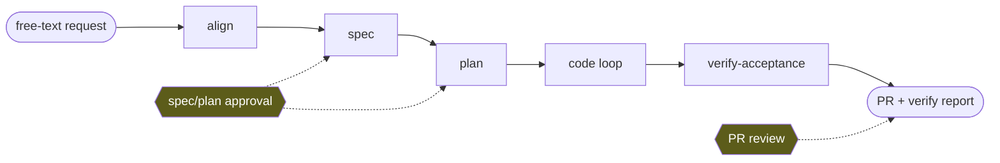
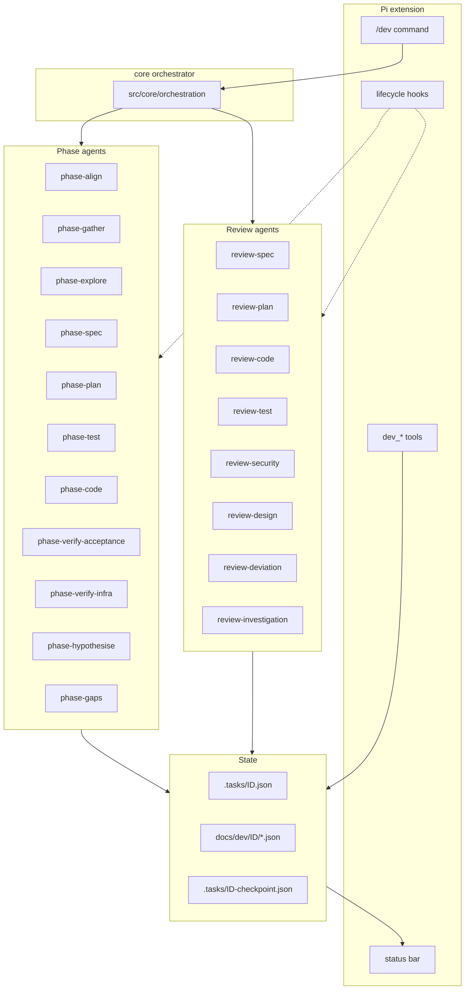
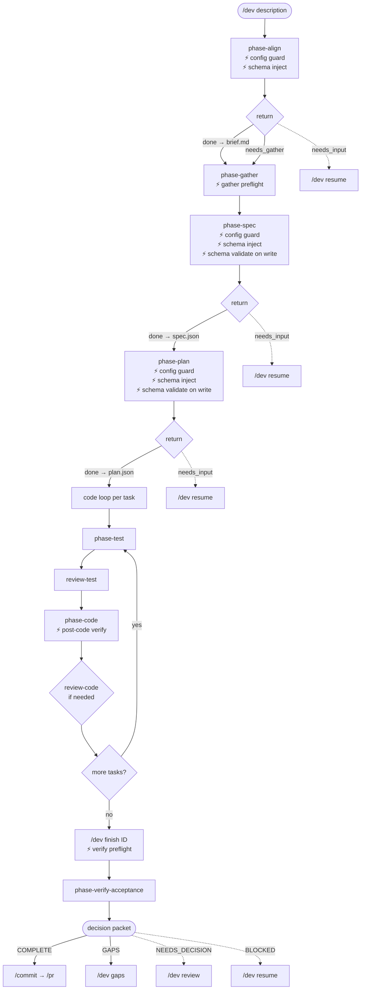
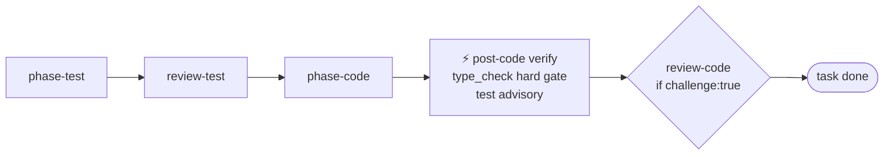
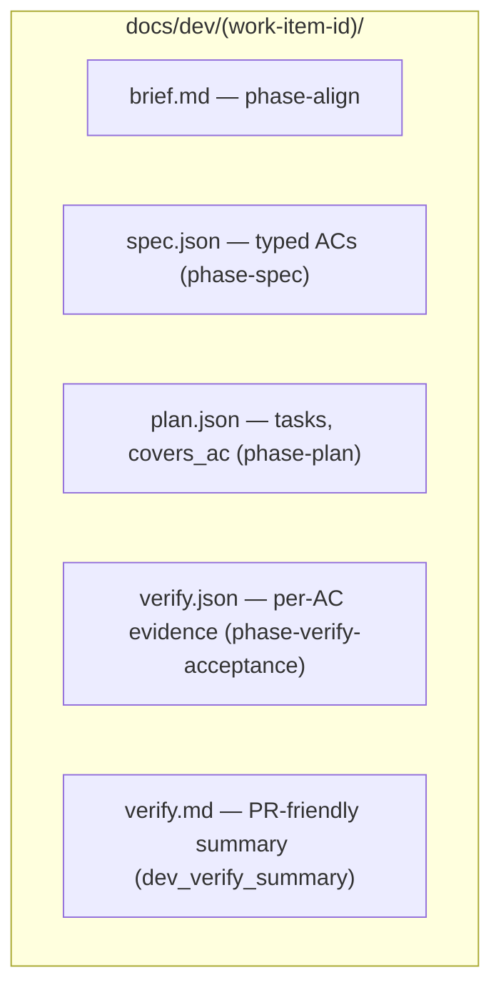
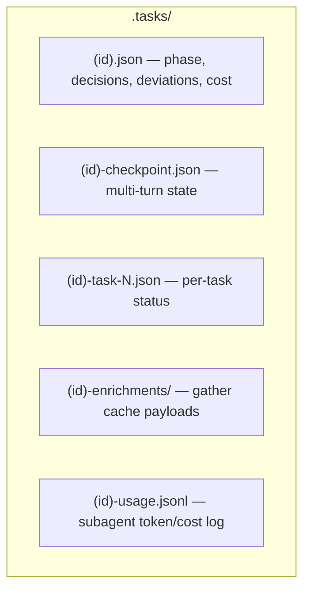
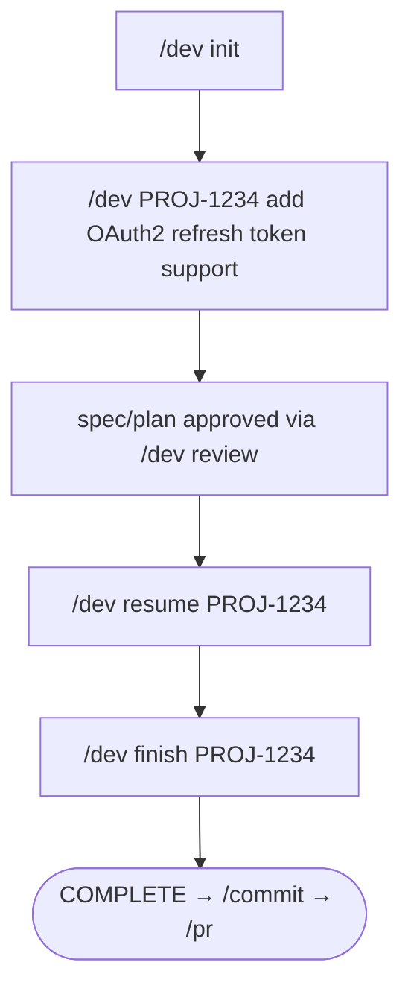

# ACCORD agentic workflow

What the ACCORD harness actually delivers — phases, agents, schemas, hooks, and commands. As-built, not aspirational. For the design rationale and research lineage, see [`accord-research.md`](accord-research.md).

---

## Table of Contents

1. [What ACCORD Is](#what-accord-is)
2. [Architecture at a Glance](#architecture-at-a-glance)
3. [Patterns and Variants](#patterns-and-variants)
4. [The Standard Pipeline](#the-standard-pipeline)
5. [Phase Agents](#phase-agents)
6. [Review Agents](#review-agents)
7. [Artifacts](#artifacts)
8. [Hooks](#hooks)
9. [Commands](#commands)
10. [Decision Packets](#decision-packets)
11. [Recovery and Resume](#recovery-and-resume)

---

## What ACCORD Is

ACCORD is a Pi extension that adds the `/dev` command. It runs an agentic, schema-driven pipeline that takes a free-text request and delivers code, verified against an explicit, immutable contract.

The contract has three artifacts:

- A **brief** — the problem framed in human language.
- A **spec** — typed acceptance criteria with stable ids (`AC-1`, `AC-2`, …) the rest of the pipeline references.
- A **plan** — tasks that map back to ACs (`covers_ac`), with file lists and step tags.

Everything downstream is evaluated against these artifacts, not against the conversation. The engineer approves once at the spec/plan gate and once at PR review; everything in between is autonomous.



The two yellow gates are the only synchronous human attention costs. Everything else lands in the decision queue for batched review.

---

## Architecture at a Glance



| Layer        | Lives in              | Responsibilities                                                                |
| ------------ | --------------------- | ------------------------------------------------------------------------------- |
| Pi extension | `src/adapters/pi/`    | `/dev` command, autocomplete, local subcommands, orchestrator host, lifecycle hooks, tools |
| Core orchestrator | `src/core/orchestration/` | Deterministic workflow routing, resume/finish loops, return-packet policy, programmatic spawns |
| Phase agents | `assets/agents/accord/phase-*.md` | Do the work; each runs in an isolated subagent process                |
| Review agents | `assets/agents/accord/review-*.md` | Read-only critique; each runs in an isolated subagent process       |
| Core         | `src/core/`           | Host-neutral logic (config, artifacts, queries, briefing, telemetry, verification) |
| Schemas      | `schemas/`            | Source of truth for every artifact and every agent return packet                |

Every phase and review agent is a fresh subagent process — a separate Pi conversation with its own context window. The core orchestrator reads work item JSON on disk and structured return packets from each spawn; the main Pi session does not accumulate phase-agent context. Companion skills (`commit`, `pr`, `review`) ship under `assets/skills/` for post-implementation workflows.

---

## Patterns and Variants

ACCORD selects a pattern from the free-text request via `dev_intent` (keyword heuristics) optionally refined by `dev_intent_enrich` (ticket metadata: AC count, story points, subtasks, description length).

| Pattern            | Variant       | When                                                       | Pipeline shape                                                                              |
| ------------------ | ------------- | ---------------------------------------------------------- | ------------------------------------------------------------------------------------------- |
| `implement`        | `standard`    | Default for "add / implement / build / feature" + ticket   | align → gather → spec → plan → (test → code) per task → verify-acceptance                  |
| `implement`        | `express`     | "quick one", "no ceremony"                                 | gather → code → post-code hook → optional review                                                |
| `implement`        | `orchestrated`| 3+ parallelisable tasks                                    | align → gather → spec → plan → parallel code worktrees → sequential merge → verify          |
| `quick_fix`        | —             | "fix a typo", one-line, target path obvious                | dev_quick_fix_brief → optional test → code → post-code hook                                    |
| `investigate`      | —             | "why", "root cause", "investigate"                         | gather → explore → hypothesise → test → report                                              |
| `infra`            | —             | Terraform, Helm, Kubernetes, Pulumi, CloudFormation        | gather → explore → code (IaC) → verify-infra → report                                       |
| `analyse`          | —             | "ADR", "design doc", "compare options"                     | gather → explore → draft → review-design → report                                           |

`implement/standard` is the canonical pipeline; the rest are variations on it that drop or substitute phases. The hooks and decision-packet machinery are identical across all patterns.

---

## The Standard Pipeline

`implement/standard` end-to-end. `⚡` marks where Pi lifecycle hooks fire. Dotted lines are user-pause boundaries.



### Phase boundaries

Each phase is dispatched as a separate subagent process. The core orchestrator (via the Pi adapter host):

1. **Constructs a brief** for the phase from the work item, the relevant slice of the spec/plan, the active decisions, and the preflight report.
2. **Spawns the agent** programmatically (`runSubagent`, same isolated child process as the `subagent` tool). The brief is the only context the agent has.
3. **Reads the return packet** — a JSON blob in the agent's final assistant message, validated against `schemas/return-schemas/<agent>.json`.
4. **Processes the packet**: writes artifacts, updates work item phase, promotes events (escalations → decisions, deviations → deviations), increments cost.
5. **Routes to the next phase** based on the packet's `status` field (`done`, `needs_input`, `stuck`, `blocked`) and orchestration policy (retry caps, severity gates).

Multi-turn phases (`spec`, `plan`) loop spawn → return → answer → respawn. Each respawn is a fresh process; continuity comes from the checkpoint (`/.tasks/<ID>-checkpoint.json`) which carries the partial draft and the answered/pending question lists.

### Per-task code loop

Each task in `plan.tasks[]` runs through:



`phase-test` writes a failing test mapped to the task's `covers_ac`. `review-test` (read-only, pre-impl) adversarially checks assertion quality, AC coverage, and edge cases before `phase-code` runs. `review-code` (post-impl) reviews production code separately so test and code reviewers do not cross-anchor. The post-code hook re-runs the structural commands declared in the project's `## Dev Harness` block; type-check failure is a hard gate, test failure is advisory (the agent may still legitimately have left tests red for the next task).

`review-code` only runs when the task is flagged `challenge: true` in the plan, or when the code agent emits a `request_review` event mid-task.

---

## Phase Agents

All phase agents have isolated context. Tools and write permission vary by role.

| Agent                   | Tools                   | Input                                          | Output (return packet)                                                  |
| ----------------------- | ----------------------- | ---------------------------------------------- | ----------------------------------------------------------------------- |
| `phase-align`           | read, bash              | Free-text request, ticket id (if any)          | `{ status, brief?: { problem, options }, questions? }`                  |
| `phase-gather`          | read, bash              | Brief, provider playbooks (preflight-injected) | `{ context, files_mentioned, enrichment_cache }`                        |
| `phase-explore`         | read, bash              | Search terms, directories                      | `{ files, symbols, reuse_candidates }`                                  |
| `phase-spec`            | read, write, edit       | Brief, gather context, prior answers           | `{ status, path, questions? }`                                          |
| `phase-plan`            | read, write, edit       | Spec, exploration, prior answers, guidance     | `{ status, path, tasks, questions? }`                                   |
| `phase-test`            | read, write, edit, bash | Task, ACs, files                               | `{ status, files_changed, tests_red, ac_mapping }`                      |
| `phase-code`            | read, write, edit, bash | Task, ACs, steps                               | `{ status, files_changed, tests_passing, deviations?, question? }`     |
| `phase-hypothesise`     | read, bash              | Investigation log                              | `{ hypotheses: [{ statement, evidence, test_plan }] }`                  |
| `phase-verify-acceptance` | read, bash            | Spec, plan, code, tests                        | `{ verdict, criteria: [{ ac_id, status, evidence }], summary }`         |
| `phase-verify-task`     | read, bash              | Verify-only plan task, AC slice                | `{ status, evidence }` — used when a plan task has no code step           |
| `phase-verify-infra`    | read, bash              | IaC paths                                      | `{ valid, preview, resources }`                                         |
| `phase-gaps`            | read, write             | verify.json, existing tickets                  | `{ gaps: [{ ac_id, suggested_action, recommended_ticket }] }`           |

Every agent's return shape is enforced by `schemas/return-schemas/<agent>.json` and validated by the orchestrator on receipt. Malformed output retries inside the agent's own context — never reaches the engineer.

### Pattern → phase mapping

| Pattern                | Phase sequence                                                                                                          |
| ---------------------- | ----------------------------------------------------------------------------------------------------------------------- |
| `implement/standard`   | align → gather → spec* → plan* → (test → review-test → code → post-code-hook → [review-code]) per task → verify-acceptance |
| `implement/express`    | gather → code → post-code hook → [review-code]                                                                          |
| `implement/orchestrated` | align → gather → spec* → plan* → parallel-worktrees(test → code) → sequential merge → verify-acceptance                |
| `quick_fix`            | quick_fix_brief → [test → review-test] → code → post-code-hook                                                          |
| `investigate`          | gather → explore → hypothesise → test → report                                                                          |
| `infra`                | gather → explore → code (IaC) → verify-infra                                                                            |
| `analyse`              | gather → explore → draft → review-design                                                                                |

`*` = multi-turn loop. `[review-X]` = spawned conditionally (challenge flag or explicit request).

---

## Review Agents

All read-only (`write: false, edit: false, bash: false`). All emit findings in the same shape:

```jsonc
{
  "verdict": "issues",   // "clean" | "issues"
  "findings": [
    {
      "severity": "critical",  // critical | warning | suggestion
      "file": "src/services/auth.ts",
      "line": 142,
      "issue": "Refresh token not rotated — allows replay",
      "evidence": "Line 142: returns existingToken instead of generating new one",
      "recommendation": "Generate new refresh token and invalidate the old one"
    }
  ]
}
```

| Agent                  | Focus                                          | Triggered when                              |
| ---------------------- | ---------------------------------------------- | ------------------------------------------- |
| `review-spec`          | AC consistency, scope coherence, completeness  | After spec draft                            |
| `review-plan`          | AC coverage, reuse compliance, TDD ordering    | After plan draft                            |
| `review-test`          | Adversarial test quality, AC coverage, edge cases | **Pre-impl** (after `phase-test`, before `phase-code`); `/review` skill (post-impl on finished diff) |
| `review-code`          | Correctness, drift from plan, complexity       | **Post-impl** after `phase-code` (mandatory) |
| `review-security`      | OWASP top 10, auth, payment, supply chain      | Security-sensitive paths after phase-code (before review-code); `/review` skill |
| `review-design`        | Reasoning quality, citation soundness          | After design draft (`analyse` pattern)      |
| `review-investigation` | Hypothesis quality, anti-anchoring             | After hypotheses formulated (`investigate`) |
| `review-deviation`     | Whether a deviation should be accepted/reverted| When a code agent emits a `deviation` event |

**Auto-downgrade rule.** Findings without `file` + `line` are downgraded to `suggestion` by the orchestrator before being surfaced. There is no path to ship a `critical` finding without a citation.

**Independence.** `review-test` (pre-impl) and `review-code` (post-impl) run in **separate** processes at different pipeline stages. Neither sees the other's findings until the orchestrator merges them — preventing cross-anchoring. The standalone `/review` skill may spawn `review-test` post-impl against a finished diff.

---

## Artifacts

Two layers: committed artifacts (the contract) and transient runtime state (gitignored).

### Committed (`docs/dev/<ID>/`)



These files are immutable after their generating phase emits `done`. The schemas live in `schemas/{spec,plan,verify}-schema.json`.

### Transient (`.tasks/`, gitignored)



The work item file is the orchestrator's authoritative state. It carries:

- `pattern` and `variant` (e.g. `implement` / `standard`)
- `phase` (e.g. `speccing`, `planning`, `implementing`, `verifying`, `complete`)
- `decisions[]` — open and resolved questions, including escalations promoted from per-task event logs
- `deviations[]` — autonomous divergences from the plan, awaiting accept/revert
- `cost_usd` — derived sum of per-task usage events × model pricing

### Spec acceptance criteria

Four AC types, each with its own verification path:

| Type            | Format                       | Verified by                       |
| --------------- | ---------------------------- | --------------------------------- |
| `scenario`      | Gherkin Given/When/Then      | Generated test mapped to AC id    |
| `constraint`    | Plain criterion              | Runtime assertion or perf test    |
| `architectural` | Criterion + enforcement rule | Lint rule (no test required)      |
| `property`      | Plain criterion              | Property-based test (future)      |

Every AC has a stable `id` (`AC-1`, `AC-2`, …), a `requirement` level (`MUST`, `SHOULD`, `MAY`), and is referenced by plan tasks (`covers_ac`) and verification (`criteria[].ac_id`).

### Verification report

```jsonc
{
  "verdict": "gaps",     // "pass" | "gaps"
  "criteria": [
    {
      "ac_id": "AC-1",
      "status": "pass",
      "evidence": [{ "type": "test", "name": "...", "file": "...", "line": 42 }]
    },
    {
      "ac_id": "AC-3",
      "status": "fail",
      "evidence": [],
      "gap": "No test covers configurable TTL via AUTH_REFRESH_TOKEN_TTL",
      "suggested_action": "Add AUTH_REFRESH_TOKEN_TTL env var and wire into TokenStore"
    }
  ],
  "summary": { "pass": 3, "fail": 1, "partial": 0, "not_verified": 0 }
}
```

Gaps are filtered from `criteria` at render time — there is no separate `gaps` array. Single source of truth.

---

## Hooks

Pi lifecycle events are mapped to host-neutral functions in `src/core/harness/`. Cursor and other hosts can invoke the same functions from their own hook scripts.

| Hook                          | Fires on                                        | What it does                                                                                  |
| ----------------------------- | ----------------------------------------------- | --------------------------------------------------------------------------------------------- |
| **Schema validation**         | `tool_result` for write/edit on artifact paths  | Looks up the schema for the file path, validates, rejects malformed writes                    |
| **Config auto-refresh**       | `tool_result` for write/edit on `AGENTS.md`     | Reloads cached `devConfig` so subsequent hooks see the latest project settings                |
| **Config guard + brief inject** | `tool_call` for `subagent`                    | Blocks agents requiring config when none exists; injects project stack + schemas into brief   |
| **Gather preflight**          | `tool_call` for `subagent` `phase-gather`       | Checks tracker + enrichment availability; injects provider playbook paths into the brief      |
| **Subagent result processing**| `tool_result` for `subagent`                    | Tracks usage, extracts and validates return packet, runs post-code verification               |
| **Verify preflight**          | `tool_call` for `subagent` `phase-verify-*`     | Checks spec/plan freshness; runs `verification_commands`; injects results into the verify brief |
| **End-of-turn notification**  | `agent_end`                                     | Counts pending decisions across all work items; notifies if any exist                         |
| **Session start**             | `session_start`                                 | Loads `devConfig`, discovers work items, restores status bar, runs asset bootstrap            |
| **Asset bootstrap**           | `session_start`                                 | Auto-links bundled skills/agents/providers if missing or stale; notifies on restart-required  |
| **Status bar**                | continuous                                      | Language, active work item, phase, pending decisions, cumulative cost                         |

The schema-validation, config-guard, and post-code-verification hooks are the structural enforcement layer — they catch the failures that no agent should ever be asked to catch.

---

## Commands

`/dev` (alias `/accord`) is the only entry point. Routing is deterministic — see `src/core/commands/subcommand-routing.ts` and `src/core/commands/help.ts`.

```
/dev init                    — detect stack, write ## Dev Harness block to AGENTS.md (in-session dev_init_* flow)
/dev <description>           — classify intent, optional bootstrap, resume when ID present; else in-session follow-up
/dev align <ID>              — core orchestrator → phase-align
/dev spec <ID>               — core orchestrator → phase-spec
/dev plan <ID>               — core orchestrator → phase-plan
/dev resume <ID>             — core orchestrator: continue from current phase + checkpoint (replans in one command)
/dev rehydrate <ID>          — recreate .tasks/ state from committed docs/dev/<ID>/ artifacts
/dev finish <ID>             — core orchestrator: verify-acceptance → dev_verify_summary → dev_finalize
/dev check <ID>              — core orchestrator: lower-level acceptance checks
/dev gaps <ID>               — list verify gaps (--tickets spawns phase-gaps via orchestrator)
/dev review                  — decision queue dashboard
/dev tasks                   — dashboard: status, phase, cost per work item
/dev deviations <ID>         — list/accept/revert deviations (review spawns review-deviation)
/dev amend-spec <ID>         — core orchestrator: controlled spec amendment
/dev spec-gaps <ID>          — 10-point spec checklist
/dev retro                   — analyse harness sessions for shift-left improvements
/dev tag                     — label session for usage analytics
/dev help                    — list subcommands
```

Set `ACCORD_CORE_ORCHESTRATOR=0` to disable programmatic spawns (not recommended — the bundled accord skill was removed).

The canonical happy path is short:



`/dev review` is the batched-attention surface. The engineer opens it on their own schedule (typically every 1–2 hours) and answers everything pending in one focused pass.

---

## Decision Packets

Every phase that requires engineer attention emits a structured packet. Format depends on the pattern, but the shape is always: **verdict** + **summary** + **next action**.

### Verification complete

```
VERIFICATION COMPLETE
  Verdict: gaps (3/4 pass)
  AC-1: pass (test: expired token returns 401, auth.test.ts:42)
  AC-2: pass (test: valid refresh token returns new access token, auth.refresh.test.ts:18)
  AC-3: fail — no test for configurable TTL
  AC-4: pass (enforced: eslint no-direct-jwt)
  Gaps: 1 criterion unimplemented
  Ready for: fix gaps or accept scope reduction
```

### Task complete (per-task during code loop)

```
TASK 2 COMPLETE
  ACs covered: AC-2, AC-3
  Tests: 8 passing, 5 new
  Deviations: none
  Review: clean
  Ready for: next task or /dev finish
```

### Decision packet (escalation)

```
DECISION REQUIRED — PROJ-1234, task 2
  Question: AuthService.refresh() doesn't handle offline tokens. Extend or new method?
  Context: src/services/auth.ts:142
  Tried: Extended, but offline flow needs different error handling
  Ready for: answer in /dev review
```

The packet is the **only** thing the engineer needs to read to make a decision. There is no expectation that they re-load the spec, the plan, or the conversation.

---

## Recovery and Resume

Every phase is designed to resume from a cold start. State lives in JSON, never in conversation history.

### Between phases

When a phase emits `done`, its artifact is committed and the work item phase advances. Re-entering the pipeline — even from a fresh Pi session — picks up at the next phase. `/dev resume <ID>` is the canonical entry point.

### Mid-phase (multi-turn)

`phase-spec` and `phase-plan` are multi-turn. After each engineer answer, the agent respawns with a fresh context but receives the prior partial draft via the checkpoint:

```jsonc
// .tasks/<ID>-checkpoint.json
{
  "phase": "speccing",
  "draft": { /* partial spec JSON */ },
  "answered": ["q1", "q2"],
  "pending": ["q3"]
}
```

The checkpoint is overwritten atomically (write to `.tmp`, rename) on every LLM response. Mid-write crashes leave the previous checkpoint intact.

### Mid-task

The per-task file (`.tasks/<ID>-task-N.json`) carries `phase` (`phase-test` | `phase-code` | `phase-verify-code`), `status` (`pending` | `in_progress` | `done` | `blocked`), and an append-only event log (`usage`, `escalation`, `deviation`, `request_review`). Each task file is owned by exactly one worktree (in the orchestrated variant) — no concurrent write contention.

The orchestrator validates `task_id` matches the filename and `owner_nonce` matches the value assigned at spawn before accepting any read-back. Mismatches surface in the decision queue.

### Stuck handling

A stuck agent emits `{ status: "stuck", question, context, tried }`. The orchestrator promotes the escalation to a `decision` entry in the work item JSON. The engineer answers via `/dev review`; the orchestrator respawns the agent with the answer. There is no auto-retry on `stuck` — a clear question is more useful than a wasted retry.

---

## Where to Read More

Each topic has a dedicated reference document alongside this one:

| Topic                                | Doc                                                |
| ------------------------------------ | -------------------------------------------------- |
| Design rationale and research        | [`accord-research.md`](accord-research.md)         |
| Concepts and architecture            | [`concepts.md`](concepts.md)                       |
| Pipeline (per-pattern)               | [`pipeline.md`](pipeline.md)                       |
| Artifacts and IDs                    | [`artifacts.md`](artifacts.md)                     |
| Schemas                              | [`schemas.md`](schemas.md)                         |
| Hooks and tools                      | [`hooks-and-tools.md`](hooks-and-tools.md)         |
| Packaged assets                      | [`packaged-assets.md`](packaged-assets.md)         |
| Project configuration                | [`configuration.md`](configuration.md)             |
| Extending (languages, agents, providers) | [`extending.md`](extending.md)                 |
| File structure                       | [`file-structure.md`](file-structure.md)           |
| Local development                    | [`local-development.md`](local-development.md)     |
