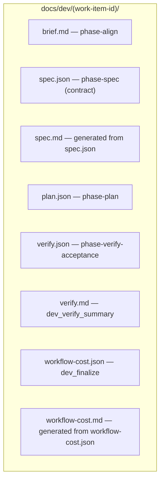
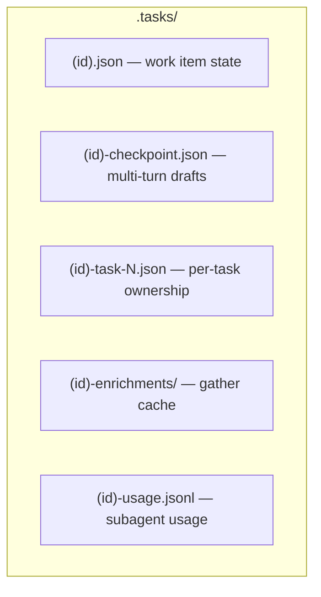

# Artifacts and work item IDs

## Artifact layout

Committed artifacts — one directory per work item:

Transient state — gitignored:

See [`docs/schemas.md`](schemas.md) for the JSON schema each file is validated against.

`spec.md` is **derived** from `spec.json` (including optional `diagrams[]` Mermaid blocks). The harness regenerates it whenever `spec.json` is validated under `docs/dev/<ID>/`. Edit `spec.json` only.

`workflow-cost.json` and `workflow-cost.md` are written at **`/dev finish`** closeout (or `dev_finalize`). They roll up token usage from `.tasks/<ID>-usage.jsonl`. Edit neither file by hand — regenerate by re-running finalize if usage was recorded late.

## Work item IDs

Pattern: `^[A-Z]+(-[A-Z]+)*-\d+$`

- Ticket-based: `ACCORD-1234`, `BUG-42`
- No-ticket (keyword slug): `AUTH-REFRESH-1`, `ADD-DARK-MODE-1`
