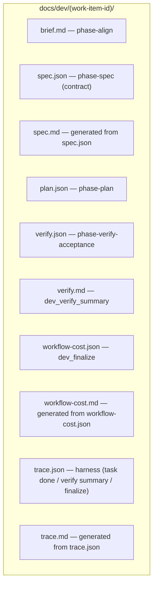
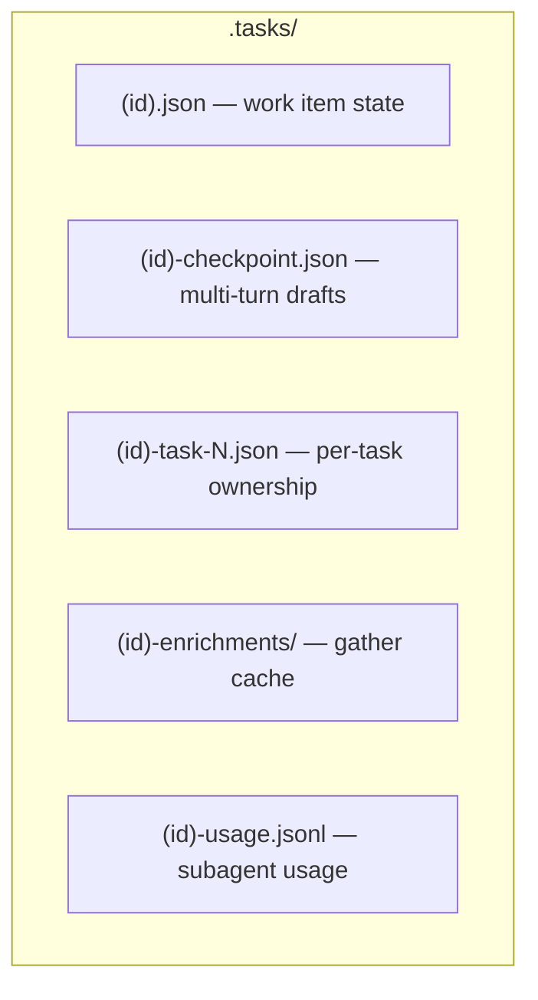

# Artifacts and work item IDs

## Artifact layout

Committed artifacts — one directory per work item:

```mermaid
flowchart TB
  subgraph dev["docs/dev/(work-item-id)/"]
    brief["brief.md — phase-align"]
    spec["spec.json — phase-spec (contract)"]
    specmd["spec.md — generated from spec.json"]
    plan["plan.json — phase-plan"]
    vjson["verify.json — phase-verify-acceptance"]
    vmd["verify.md — dev_verify_summary"]
    wcjson["workflow-cost.json — dev_finalize"]
    wcmd["workflow-cost.md — generated from workflow-cost.json"]
    trjson["trace.json — harness (task done / verify summary / finalize)"]
    trmd["trace.md — generated from trace.json"]
  end
```

Transient state — gitignored:

```mermaid
flowchart TB
  subgraph tasks[".tasks/"]
    wi["(id).json — work item state"]
    cp["(id)-checkpoint.json — multi-turn drafts"]
    tk["(id)-task-N.json — per-task ownership"]
    en["(id)-enrichments/ — gather cache"]
    us["(id)-usage.jsonl — subagent usage"]
  end
```

See [`docs/schemas.md`](schemas.md) for the JSON schema each file is validated against.

`spec.md` is **derived** from `spec.json` (including optional `diagrams[]` Mermaid blocks). The harness regenerates it whenever `spec.json` is validated under `docs/dev/<ID>/`. Edit `spec.json` only.

`workflow-cost.json` and `workflow-cost.md` roll up token usage (input, cache read/write, output, calls, estimated cost) from `.tasks/<ID>-usage.jsonl`. They are refreshed whenever a task commits, whenever `verify.md` is rendered (so `/dev check` and repeated `/dev finish` runs are reported), and at finalize. Edit neither file by hand. Because the rollup is committed, rehydrating a lost `.tasks/` seeds the usage log from it (`carried_forward` lines) instead of starting from zero.

`trace.json` and `trace.md` are the committed projection of the transient `.tasks/` state: per-AC implementation and verification (tasks, files, verified tests), accepted and unresolved review findings, decisions, deviations, per-task commits and rounds, plus short excerpts of each task's first RED test run and final verification output. Raw agent packets and loop-control state stay in `.tasks/`. The harness rewrites the trace when a task completes (it rides in that task's commit), when `verify.md` is rendered, and at finalize — never edit it.

`verify.md` is the **single review document**: each AC shows the independent `phase-verify-acceptance` verdict and evidence alongside the trace's implementation record, followed by the task table, accepted risks, decisions/deviations, and a **Discrepancies** section (verify passes an AC the trace does not show satisfied, ACs missing on either side, done tasks without a commit, unresolved gating or critical findings). Discrepancies are advisory — they do not change the verdict.

`verify.json` must match `verify-schema.json`. Subagents write it outside the host's write hooks, so the harness validates it when the agent returns and again before finalize; an invalid report is not applied and the work item is not finalized.

Every plan task that reaches `done` gets a harness commit; closeout commits the remaining `docs/dev/<ID>/` files. See `orchestration.commit` in [configuration](configuration.md#per-task-commit-orchestrationcommit).

## Work item IDs

Pattern: `^[A-Z]+(-[A-Z]+)*-\d+$`

- Ticket-based: `ACCORD-1234`, `BUG-42`
- No-ticket (keyword slug): `AUTH-REFRESH-1`, `ADD-DARK-MODE-1`
