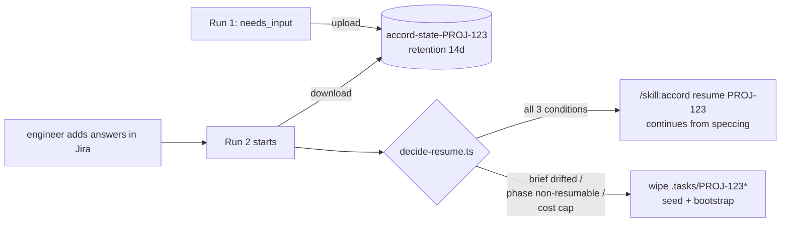

# Problem Brief: ticket-to-pr-feature

> **Provenance.** Hand-authored design brief for the Jira → ACCORD → PR autopipeline. Captures the full plan-mode discussion (5 turns) so a future `phase-spec` (or any reader) has the same context the author and orchestrator built up. Not generated by `phase-align`; the entry phase for the implementation will be `phase-spec`.

## Core Problem

Engineering work today follows the path Jira ticket → human picks it up → human runs `/dev` locally → human pushes a PR. Every well-formed ticket goes through the same mechanical sequence (spec, plan, implement against tests, verify, commit, PR), and ACCORD already automates that sequence end-to-end given an agreed brief. The cost of inaction is that engineering time is spent driving a deterministic pipeline that the harness can drive itself, and that the latency between "ticket is ready" and "PR is in review" is gated by human availability rather than by the work's complexity.

We want any GitHub repository to be able to opt into a fully autonomous Jira → PR pipeline by adding ten lines of YAML and four secrets, with the pipeline triggered when a Jira ticket transitions into a designated status. The pipeline must verify that the ticket carries enough information to skip the alignment phase and either (a) run all of spec → plan → code → verify → commit → PR autonomously, or (b) exit cleanly with a structured Jira comment explaining what is missing.

## Stakeholders

**End users (engineers in consumer repos).** They author Jira tickets and consume the resulting PRs. Their expectation is that a well-written ticket produces a reviewable PR within the runtime budget without further input. When the ticket is insufficient, they want the gate to tell them precisely what to add — not a generic "rejected" message. Their experience today is the same flow but driven by their own keystrokes.

**Engineering managers.** They sponsor the work because (1) it shifts well-defined work off the human queue, freeing senior time for ambiguous problems; (2) it standardises ticket quality by making the gate's checklist visible and unbypassable; (3) it makes "agent-driven delivery" a default rather than an opt-in per engineer.

**Platform / DevX (the audience this brief is being authored by).** Owns the workflow, the composite actions, the scripts, the documentation, and the operator runbook. Responsible for keeping the v1 surface stable, the costs bounded, and the failure modes legible.

**Compliance / SRE.** Care about secret handling (Anthropic key, Jira token, GitHub token), the blast radius of an autonomous agent committing to consumer repos, and that PRs require human approval before merge.

**Sign-off.** Project owner (cshirley) signs off on the v1 surface and the consumer onboarding contract. No regulatory sign-off; no PII in scope.

## Current State

`pi-accord` ships ACCORD as a Pi extension. The harness is fully usable interactively today via the `/dev` command and was designed from the start so that "every phase runs in a fresh window; all state persists to `.tasks/` and `docs/`" (see `assets/skills/accord/SKILL.md`). The persistence model means that the same skill that drives an interactive session can be driven by a sequence of headless `pi -p` calls without losing state between phases.

Pi itself supports headless execution via `pi -p` (print mode) and `pi --mode json` (JSON-event-stream mode). Both are documented in `node_modules/@mariozechner/pi-coding-agent/docs/{quickstart,json,sdk,usage}.md`. The CLI exposes a stable contract; the SDK exists for embedding Pi in larger applications and has a richer but lower-level surface.

Jira → GitHub triggering is solved at the integration layer: Atlassian Automation can fire `POST https://api.github.com/repos/<owner>/<repo>/dispatches` on a status transition, which surfaces in GitHub Actions as a `repository_dispatch` event with arbitrary `client_payload`.

GitHub Actions has two distribution mechanisms relevant here: reusable workflows (`on: workflow_call`) and composite actions (`action.yml`). Reusable workflows give consumers a "10 lines of YAML" path; composite actions give consumers a "drop into your own workflow as a step" path. We can ship both from the same scripts.

ACCORD's existing `phase-gather` writes a `## Gathered Context` section into the brief; `phase-spec` consumes the brief plus optional `enrichments`. The same shape can be produced by a deterministic CI script that fetches the Jira ticket and synthesises the brief — no agent call needed.

This repository has no existing `.github/` directory and no CI scaffolding. `.gitignore` ignores `.tasks/` (transient state) but not `docs/dev/` (committed artifacts).

## Desired Outcome

**Consumer-side.** A repository owner adds one workflow file, four secrets, and an optional `AGENTS.md`, and one Jira automation rule (per Jira project, not per repo). When a ticket transitions to the configured status, a PR is opened against the consumer's repo within the runtime budget, or a Jira comment is posted explaining why the autopipeline declined.

**Developer-side (Platform / DevX).** A reusable workflow + composite action live in `cshirley/accord` under `.github/`. The TypeScript scripts that implement the gate, the seed, the phase orchestration, the Jira reporting, and the commit/PR step live under `scripts/ci/` and are unit-tested with `bun test` against fixtures. A self-test workflow on this repo's PRs exercises the full pipeline in dry-run mode against fixture tickets so regressions are caught before consumers feel them.

**Behavioural contract (the most important success metric).**

1. A ticket that passes the gate and runs to completion produces a PR that is at least as good as a PR a human would have produced from the same ticket using ACCORD interactively. The verify report and the spec/plan are committed alongside the code; the PR body cites the spec ACs and the verify evidence.
2. A ticket that fails the gate produces a Jira comment that lists exactly which checks failed and how to fix the ticket. Status transitions back to `Needs Triage` (configurable). Workflow exit is success — the gate did its job.
3. A ticket that passes the gate but encounters a phase return of `needs_input`, `blocked`, `gaps`, or a cost-exceeded condition produces a Jira comment with the structured questions / blockers / cost summary, transitions the ticket to a configurable status, and uploads `docs/dev/<ID>/` and `.tasks/<ID>*` as workflow artifacts. Workflow exit is success.
4. Hard-fail (non-zero exit) is reserved for unrecoverable infrastructure problems: checkout failed, Pi failed to install, secrets missing. Anything reportable to the human goes via Jira comment + success exit.

## Security & Data

**Secrets in scope.**

- `ANTHROPIC_API_KEY` — Pi LLM auth. Lands in the runner via `secrets:` in the reusable workflow. Never logged.
- `JIRA_BASE_URL`, `JIRA_USER_EMAIL`, `JIRA_API_TOKEN` — Jira REST auth (basic auth via email + token, per Atlassian standard).
- `GITHUB_TOKEN` (default) for same-repo PRs; `GH_PAT_PR` only required for cross-repo PRs.
- The Jira → GitHub Automation rule on the Atlassian side requires a GitHub PAT stored in Atlassian Automation's secret slot. Out of scope for our repo; documented in `docs/ci/atlassian-automation.md`.

**Trust boundaries.**

- The reusable workflow runs with `permissions: contents: write, pull-requests: write, issues: write` minimum. It cannot escalate beyond what the consumer grants it.
- The agent runs against the consumer's checkout with full `read/write/edit/bash` (this is what ACCORD always does — the harness, not us, is the trust boundary). PRs require human review before merge; we do not enable auto-merge.
- The `pi-accord` package is `pi install`ed at runtime against a tag (`accord_ref` input, default `v1`). Consumers pin to a major tag for low-touch updates or a SHA for reproducibility.

**Compliance.** No PII; no PCI; no PHI. The agent operates on the consumer's source code; what they ship in their repo is their own concern.

**Secret hygiene.** The composite `setup-pi` action sets `PI_OFFLINE=1` and `PI_SKIP_VERSION_CHECK=1` to avoid outbound calls. Jira REST calls go directly from the runner to the consumer's Jira tenant; no proxy.

## Infrastructure & Deployment

**Where the code lives.** `cshirley/accord` (this repo) ships:

- `.github/workflows/autopipeline.yml` — the reusable workflow (`on: workflow_call`).
- `.github/workflows/test-autopipeline.yml` — self-test on PRs.
- `.github/actions/setup-pi/action.yml` — composite for installing Pi + ACCORD + warm-up.
- `.github/actions/run-accord-phase/action.yml` — optional composite that wraps `run-phase.ts`.
- `scripts/ci/*.ts` — gate, seed, bootstrap, run-phase, parse-phase-result, jira-comment, dev-init-if-missing, commit-and-pr.
- `tests/ci/**` — fixtures + bun unit tests.
- `examples/consumer-repo/` — copy-paste starting kit for a consumer.
- `docs/ci/{autopipeline,consumer-quickstart,atlassian-automation,troubleshooting}.md`.

**How a consumer wires it in.** Four artifacts in the consumer repo:

1. One workflow file at `<consumer-repo>/.github/workflows/<any-name>.yml` (10 lines, calling `cshirley/accord/.github/workflows/autopipeline.yml@v1`). The `.github/workflows/` location is mandated by GitHub for event-triggered workflows; not configurable. Filename is free.
2. Four GitHub Secrets.
3. One `AGENTS.md` with `## Dev Harness` block (or rely on auto `/dev init`).
4. One Atlassian Automation rule per Jira project (we ship the JSON for import).

**Workflow file locations (explicit, because consumers will copy-paste).**

- The reusable workflow we ship lives at `cshirley/accord/.github/workflows/autopipeline.yml`. GitHub requires reusable workflows to live under `.github/workflows/` of their owning repo; the path is part of the public API surface (consumers `uses:` it by exact path). Moving it is a breaking change.
- The composite actions we ship live at `cshirley/accord/.github/actions/{setup-pi,run-accord-phase}/action.yml`. Composite actions are not constrained by location, but `.github/actions/` is the conventional path and consumers reference them by path (`uses: cshirley/accord/.github/actions/setup-pi@v1`); moving is also a breaking change.
- The consumer's wrapper workflow **must** live at `<consumer-repo>/.github/workflows/<any-filename>.yml`. The wrapper triggers on `repository_dispatch` events fired by Atlassian Automation; GitHub only executes workflows from `.github/workflows/` of the receiving repo.
- The starter wrapper at `cshirley/accord/examples/consumer-repo/.github/workflows/jira-autopipeline.yml` is a **documentation template only** — it is not in this repo's own `.github/workflows/` directory, so GitHub will never execute it. It exists so consumers can copy-paste a working starting point.

**Versioning.** Tag this repo `v0.x.y` per release. Maintain a moving major tag (`v1`) that follows the latest `1.x` release. Consumers pin `accord_ref: v1` for low-touch updates or `accord_ref: <sha>` for reproducibility.

**Runner topology.** Default `ubuntu-latest` (GitHub-hosted). The `runner` input accepts self-hosted labels for repos that need them. GitHub-hosted runners are fresh VMs per job — nothing persists between runs by default, so without explicit caching every dispatch reinstalls Pi, re-checks out the accord package, and re-runs `bun install` (~40–60 s cold start). The `setup-pi` composite addresses this with `actions/cache@v4` (see "Caching strategy" below). Self-hosted runners persist `~/.config/pi/agent` natively across jobs — consumers wanting zero cold-start should use them.

**Caching strategy.** `actions/cache@v4` caches four paths under one composite key:

| Path | Why |
|---|---|
| `~/.npm` | Speeds `npm i -g @mariozechner/pi-coding-agent` and any `npx` calls |
| `~/.bun/install/cache` | Speeds `bun install` in the `.accord-ci` checkout |
| `~/.config/pi/agent` (excluding `auth.json` and `sessions/`) | Skips `pi install` re-registration and asset-link work |
| `.accord-ci/node_modules` | Skips `bun install` entirely on lockfile-unchanged hits |

Cache key: `accord-${{ runner.os }}-${{ inputs.pi_version }}-${{ inputs.accord_ref }}-${{ hashFiles('.accord-ci/bun.lock', '.accord-ci/assets/manifest.json') }}` with `restore-keys` ladder for partial-hit fallback. After cache restore the composite still runs `pi install <path>` and `bun run install:assets` — these are idempotent and resolve to no-ops in seconds when the underlying state is already correct.

**Cache scope (consumer-facing fact).** GitHub Actions caches are scoped per-repo and partitioned per-branch. A run on the autopipeline-created branch (`accord/<ticket>-<slug>`) reads its own scope first, then falls back to the consumer's default branch (`main`) cache, then nothing. First autopipeline run on a fresh branch: cache miss → `main` fallback → mostly warm. Re-runs on the same branch: full hit (≤ 15 s setup). The cache lives under the **consumer's** 10 GB GitHub cache quota — not ours; not shared across consumers. LRU eviction means infrequently-used consumer repos pay cold start more often, which is acceptable.

**Cache hygiene (security).** The cache `path:` pattern explicitly excludes `~/.config/pi/agent/auth.json` and `~/.config/pi/agent/sessions/`. We use `ANTHROPIC_API_KEY` env auth so `auth.json` should never exist in the runner — but defence in depth: the cache pattern uses an exclusion list, and the composite emits a post-step that removes any `auth.json` before cache save. Sessions are excluded both for size (would grow unbounded) and to avoid leaking conversation contents across runs.

**`.tasks/` is never cached.** `.tasks/<TICKET>*` is per-work-item runtime state and is `.gitignore`d in this repo and in every consumer repo. Caching it would (a) misuse `actions/cache` as a per-ticket key/value store, (b) risk replaying a corrupt checkpoint that caused the original failure, and (c) require careful cross-ticket isolation that the artifact mechanism gives us for free. Recovery uses workflow artifacts instead — see "Recovery model" below.

**Recovery model.** Workflow artifacts — not the cache — are the recovery surface. Three rules:

1. **Always upload state on every terminal branch** (success, gate-failed, needs_input, gaps, blocked, cost_exceeded). The artifact is named `accord-state-${{ inputs.ticket }}` and contains `.tasks/<TICKET>*` and `docs/dev/<TICKET>/`. Retention 14 days. Uploaded with `if: always()` and `overwrite: true` so the latest run's state wins per ticket.
2. **At workflow start, attempt to download the prior `accord-state-<TICKET>` artifact** (cross-run, scoped to the same branch via the GitHub Actions API). Missing artifact is fine; first runs and runs after retention expiry start cold.
3. **Decide resume-vs-fresh deterministically** via `decide-resume.ts`. Resume only when **all** of:
   - WI `phase` ∈ {`speccing`, `planning`, `implementing`} (other phases — `complete`, `verifying`, `blocked` mid-verify — start fresh).
   - The freshly-seeded brief from the current Jira ticket matches the prior brief by normalised hash (whitespace/ordering insensitive). A substantively-edited ticket invalidates resume — the new brief takes precedence and we start fresh.
   - Cumulative `cost_usd` from prior runs is below `max_cost_usd`. Resume continues against the same budget; it does not reset.

Otherwise wipe `.tasks/<TICKET>*` and run the normal seed → bootstrap → spec path. The decision is logged in the Jira comment that opens the run ("resuming at phase X" vs "starting fresh: ticket brief changed since last run").

**Recovery flow.**

**Recovery dependency.** Cross-run artifact download requires either GitHub's `actions/download-artifact@v4` with the `workflow_run` API filter, or a third-party action (`dawidd6/action-download-artifact`). For v1 we use the third-party action **pinned by SHA, not tag**, with the pin documented in `docs/ci/troubleshooting.md` and reviewed on each accord release. If GitHub's first-party action gains symmetric cross-run support before we ship, we switch to it.

**Migration / rollout.** No migration. Consumers opt in repo-by-repo by adding the wrapper workflow. A consumer can roll back by deleting the workflow file. No state is shared across consumers.

**Rollback plan.** If a v1 release breaks consumers, we ship `v1.0.x` patch tagged off the previous good commit and re-point the moving `v1` tag. Consumers pinned to `v1` recover automatically; consumers pinned to a SHA are unaffected and can upgrade on their schedule.

**External dependencies.** `@mariozechner/pi-coding-agent` (npm), Atlassian Cloud (Jira REST + Automation), GitHub Actions, Anthropic API. We pin Pi via the `pi_version` input.

## Scale & Performance

**Per-run budget.** A single run's runtime is dominated by LLM latency. Process startup overhead per phase (~1–3 s × 4 phases) is negligible against a multi-minute spec + plan + code + verify cycle. Default workflow `max_runtime_minutes: 90` matches the existing harness's tolerance for a non-trivial implement/standard work item.

**Per-run cost.** Default `max_cost_usd: 20` aborts between phases if `cost_usd` on the work item exceeds the cap. ACCORD already tracks this on `.tasks/<ID>.json` via the usage hooks. Cost lands on the consumer's Anthropic account (their key, their bill).

**Concurrency.** One run per ticket. GitHub Actions concurrency group `accord-${{ inputs.ticket }}` so simultaneous transitions of the same ticket don't race. Different tickets run in parallel up to the consumer's runner quota.

**Throughput.** Not a v1 concern. We expect O(10) runs/day per consumer in early adoption.

**Caching.** Pi config dir cached across runs. The consumer's own dependency caches (e.g. `bun install`, `npm ci`) are the consumer's responsibility — we do not opine.

## Constraints

- **Headless agent constraint.** No human is available during a run. Agents that need input must surface their question structurally (return packet `status: needs_input`) so the workflow can bail with a Jira comment. This is already the harness's contract; we just enforce it at the boundary.
- **No mid-run modification of the ticket.** The agent does not write back to Jira during a run (other than via `phase-gaps` if explicitly invoked, which is out of scope for v1). Comments and transitions happen only at terminal points, driven by the workflow.
- **No PR auto-merge.** PRs require human approval. The workflow opens drafts where supported and never marks ready for review automatically.
- **Single-base-branch assumption.** The workflow targets one base branch (default `main`, configurable via `base_branch` input). Multi-branch matrices are out of scope for v1.
- **Idempotency.** A re-run on the same ticket reuses the branch (`<branch_prefix><ticket>-<slug>`) and amends the existing PR. The work item ID is the ticket key, so `.tasks/<ID>.json` and `docs/dev/<ID>/` are the same on re-runs.
- **Customisation surface (locked for v1).** Consumers configure ACCORD only via `AGENTS.md` (`## Dev Harness` block) and `accord-config.json`. No prompt-level overrides per consumer (e.g. swapping `phase-code` for a custom variant). Documented as a candidate for v2.
- **Runtime model (locked).** `pi-accord` is `pi install`ed onto the runner as a Pi package; the consumer's checkout is Pi's `cwd`. ACCORD operates on the consumer's tree.

## Approach Direction

**Primary distribution: a reusable workflow.** Consumers `uses: cshirley/accord/.github/workflows/autopipeline.yml@v1`. One wrapper workflow on the consumer side; no other YAML.

**Secondary distribution: a composite action.** For repos that need to compose ACCORD into a larger workflow (matrix builds, custom pre-checks). Same scripts, different envelope.

**Phase orchestration: CLI subprocesses.** Each phase is a `pi -p --mode json /skill:accord <phase> <ticket>` invocation. Between phases, the workflow reads `.tasks/<ID>.json` (the harness's authoritative state) and decides whether to proceed, bail with `needs_input`, abort on cost, or finalise. Rationale and the considered alternative (Pi SDK) are below.

**Direct in-process calls for ACCORD `dev_*` tools.** `bootstrap-work-item.ts` imports `dev_bootstrap` directly from `@clive.shirley/pi-accord/src/core/...`. Eliminates the `bun run mcp` sidecar that an MCP-stdio approach would require. Same approach for any other tool that the workflow calls deterministically (transitions, finalize, verify_summary). This is *not* the SDK — it's calling our own code.

**Brief seeding bypasses `phase-align`.** A deterministic CI script (`seed-brief.ts`) writes `docs/dev/<ticket>/brief.md` from the Jira ticket fields, including a `## Gathered Context` section so downstream phases skip `phase-gather`. `bootstrap-work-item.ts` then creates the work item with `phase: "speccing"`, `pattern: "implement"`, `variant: "standard"`, and the intent contract derived from `dev_intent_enrich` against the ticket signals.

**Brief-completeness gate (the user's explicit requirement).** A deterministic TypeScript checklist over the Jira ticket. Eight checks: description length, AC block presence + count, problem framing (what + why), out-of-scope statement, target paths / area hint, no blocking questions / TBDs, issue type allow-list, status correctness. Failure → Jira comment listing precisely which checks failed → transition to `Needs Triage` → exit 0. No LLM call on the gate; it is the cheap fail-fast.

**Terminal-state reporting.** Every terminal branch (gate fail, `needs_input`, `gaps`, `blocked`, cost exceeded, complete) writes a Jira comment, optionally transitions the ticket, and uploads `docs/dev/<ID>/` + `.tasks/<ID>*` as workflow artifacts. Exit code 0 from all of these — the workflow successfully reported back. Hard-fail (≠0) is reserved for infra problems.

**Self-test.** A `tests/ci/fixtures/jira/*.json` corpus drives gate unit tests. A `tests/ci/fixtures/return-packets/*.json` corpus drives parse-phase-result tests. A `dry_run: true` workflow input causes `run-phase.ts` to read mock return packets instead of invoking `pi -p`, and `jira-comment.ts` to write to a JSON log instead of POSTing. The `test-autopipeline.yml` workflow runs the full reusable workflow in dry-run on every PR.

### Why CLI not SDK (the alternative we considered)

Both options can produce identical behaviour. The discriminator is who owns the lifecycle code:

- **CLI**: we own a JSON-event-stream parser (~one file, against a documented event schema). Every other concern — process lifecycle, abort, retry, signals, model wiring, settings, extension loading — is owned by Pi. Our code is small, our reproduction story for ops is one-line ("re-run this `pi -p` command in your terminal"), and the surface we depend on is the most stable, broadly-used Pi surface.
- **SDK**: we own a session-orchestrator (lifecycle, event subscription, abort, timeout signal handling, runtime/factory creation, `bindExtensions` after replacement). Buys us type-safe events out of the box and lets us inject custom CI tools. Costs us roughly 2× the code we maintain in CI and a stronger dependency on Pi 0.x SDK semantics.

For v1 the SDK's wins (single-process MCP elimination, type-safe events, custom CI-only tools) do not justify the additional code-we-own surface area in unattended CI. We carve out one in-process exception (calling ACCORD's own `dev_*` functions directly, since they're our code) and use the CLI for the agent loop. Re-evaluate for v2 if a feature genuinely requires SDK-only capabilities.

## Open Questions

These are not blockers for `phase-spec`; they are decisions the spec phase will need to lock or hand off:

- Default `max_runtime_minutes` of 90 — is that the right v1 ceiling, or should it be lower (forcing earlier failure) or higher (giving complex tickets room)?
- Default `max_cost_usd` of 20 — same trade-off; needs a real-world calibration step once we have a few representative runs.
- Should `phase-gaps` run automatically when `finish` returns `gaps`, creating follow-up Jira tickets? Out of scope for v1 unless explicitly enabled, but worth noting as the obvious v1.1 extension.
- Should the workflow ever attempt `dev_init` auto-detection in the consumer repo if `AGENTS.md` is missing, or always hard-fail with a clear "commit AGENTS.md first" message? The plan currently says "auto-detect, fall back to hard-fail if inconclusive" — `phase-spec` should make that an explicit AC with an enforcement strategy.
- The PR body template currently mirrors `assets/skills/pr/SKILL.md` verbatim. Should the autopipeline-authored PRs carry a distinguishing marker (e.g. a `pi.dev/autopilot: v1` trailer in the PR body) so reviewers can tell them apart from human-driven PRs? Probably yes; needs a one-line decision.

## Alignment Markers

| ID | Claim | Status | Dimension |
|----|-------|--------|-----------|
| am-1 | The pipeline is consumed via a reusable workflow + optional composite action; no GitHub App, no hosted service. | confirmed | approach_direction |
| am-2 | The brief-completeness gate is deterministic (no LLM call) and is the user's explicit requirement to "verify and exit if insufficient". | confirmed | problem |
| am-3 | `phase-align` is bypassed by pre-seeding the brief from the Jira ticket; the entry phase is `speccing`. | confirmed | approach_direction |
| am-4 | Agents that emit `needs_input` cause the workflow to bail with a Jira comment — there is no human to answer mid-run. | confirmed | constraints |
| am-5 | `pi-accord` is `pi install`ed as a Pi package on the runner; the consumer's checkout is Pi's `cwd`. Without caching this reinstalls every run (~40–60 s cold start); the `setup-pi` composite caches `~/.npm`, `~/.bun/install/cache`, `~/.config/pi/agent` (sans `auth.json`, `sessions/`), and `.accord-ci/node_modules` to bring warm-path setup to ≤ 15 s. | confirmed | infrastructure_and_deployment |
| am-6 | For v1 there is no per-consumer prompt customisation surface. Configuration is `AGENTS.md` + `accord-config.json` only. | confirmed | constraints |
| am-7 | Phase orchestration uses `pi -p --mode json` subprocesses, not the Pi SDK. ACCORD's own `dev_*` tools are called in-process via direct TS imports. | confirmed | approach_direction |
| am-8 | All terminal states (gate fail, needs_input, gaps, blocked, cost exceeded, complete) exit 0; non-zero exit is reserved for infra failures. | confirmed | constraints |
| am-9 | PRs require human approval. No auto-merge. PRs may carry a "generated by autopilot" marker (decision deferred to spec). | proposed | constraints |
| am-10 | Atlassian Automation triggers the workflow via `repository_dispatch`; no self-hosted webhook receiver. | confirmed | infrastructure_and_deployment |
| am-11 | Cost lands on the consumer's Anthropic account; ACCORD's existing per-WI cost tracking is the enforcement source for `max_cost_usd`. | confirmed | scale_and_performance |
| am-12 | A self-test workflow on this repo's PRs runs the reusable workflow in `dry_run: true` against fixture tickets to catch regressions. | confirmed | infrastructure_and_deployment |
| am-13 | The reusable workflow lives at `cshirley/accord/.github/workflows/autopipeline.yml` (mandated by GitHub for reusable workflows; the path is a public API surface). The consumer's wrapper must live at `<consumer-repo>/.github/workflows/<any-filename>.yml` (mandated by GitHub for event-triggered workflows). The example wrapper under `examples/consumer-repo/.github/workflows/` in this repo is a documentation template and is never executed. | confirmed | infrastructure_and_deployment |
| am-14 | GitHub Actions caches are per-repo and per-branch (with default-branch fallback). The autopipeline's caches live under the **consumer's** 10 GB cache quota and are not shared across consumers. First run on an autopipeline-created branch falls back to the consumer's `main` cache; re-runs on the same branch are full hits. `auth.json` and `sessions/` are excluded from cache for security and size reasons. | confirmed | infrastructure_and_deployment |
| am-15 | `.tasks/<TICKET>*` is **never cached**. It is per-work-item runtime state that would misuse the cache mechanism, risk replaying corrupt state on retry, and is already covered by the artifact-based recovery model. | confirmed | infrastructure_and_deployment |
| am-16 | At every terminal branch (success or non-success) the workflow uploads `.tasks/<TICKET>*` and `docs/dev/<TICKET>/` as the `accord-state-<TICKET>` workflow artifact (`if: always()`, `overwrite: true`, retention 14 days). Re-runs cross-download this artifact via a SHA-pinned third-party action (`dawidd6/action-download-artifact`) until first-party `download-artifact@v4` gains equivalent cross-run support. | confirmed | infrastructure_and_deployment |
| am-17 | Resume eligibility is deterministic and conjunctive. `decide-resume.ts` resumes only when **all** of: (a) WI phase ∈ {`speccing`, `planning`, `implementing`}; (b) the freshly-seeded brief matches the prior brief by normalised hash; (c) cumulative `cost_usd` < `max_cost_usd`. Otherwise wipe `.tasks/<TICKET>*` and start fresh. The decision is logged in the run-opening Jira comment. | confirmed | constraints |

## Gathered Context

This brief was authored from the design discussion in plan mode; no Jira ticket exists. Source material consulted while authoring:

- `assets/skills/accord/SKILL.md` — the orchestrator's subcommand contract (`init`, `align`, `spec`, `plan`, `resume`, `finish`, …) and the persistence/`/clear`-between-rounds design that makes per-phase headless invocation viable.
- `assets/agents/accord/phase-align.md` — the brief shape used by this document; `phase-align` is bypassed in CI by pre-seeding this same shape from the Jira ticket.
- `assets/agents/accord/phase-gather.md`, `assets/providers/trackers/jira.md` — informs the `seed-brief.ts` design (the `## Gathered Context` section and the field mappings from a Jira issue).
- `assets/skills/{commit,pr}/SKILL.md` — the commit message and PR body templates the autopipeline must produce so output is indistinguishable from human-driven runs.
- `docs/accord-workflow.md`, `docs/pipeline.md` — the canonical end-to-end description of phases, hooks, and the `implement/standard` pipeline shape.
- `node_modules/@mariozechner/pi-coding-agent/docs/{quickstart,usage,json,sdk}.md` — Pi's headless surface (`pi -p`, `--mode json`) and the SDK alternative considered and declined for v1.
- `package.json` (this repo) — confirms the package is named `@clive.shirley/pi-accord`, the bundled extensions and skills, and the `bun run mcp` entry point that the SDK alternative would have used.
- `.gitignore` — confirms `.tasks/` is transient and `docs/dev/` is committed; the autopipeline preserves both invariants.

The plan-mode discussion that produced this brief covered five turns: initial scoping (this repo only), reframing to "any GitHub repo" (reusable workflow vs composite vs Docker action vs GitHub App), confirmation of the runtime + customisation model, an SDK-vs-CLI evaluation, and the final decision lock recorded in the alignment markers above.
