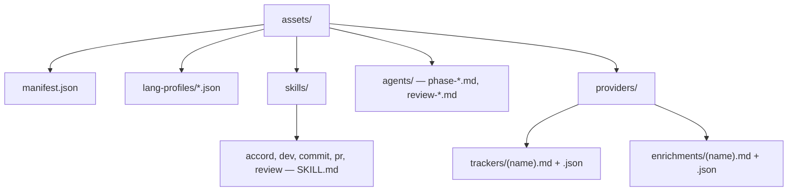

# Packaged Pi assets

The extension bundles the prompt assets it needs to run in pi.dev:



`package.json` advertises these through the `pi.skills`, `pi.agents`, and `accord.assetManifest` fields. The Pi adapter drives workflow via `/dev` and the core orchestrator (programmatic `subagent` spawns). Companion skills (`commit`, `pr`, `review`) and phase agents install via the asset linker.

## Installer

Install or refresh the bundled Pi assets with:

```bash
bun run install:assets
```

The installer targets `~/.config/pi/agent` by default, creates relative symlinks to the bundled assets, refuses to replace locally modified files unless `--force` is supplied, supports `--dry-run`, and writes `.accord-assets.json` metadata with the package version and manifest checksum.

## Validation

Run `bun run validate:assets` after prompt, registry, provider, or manifest changes. It checks that bundled skill and agent frontmatter names match, the manifest matches `src/core/agents/registry.ts`, the manifest provider lists match the sidecars under `assets/providers/{trackers,enrichments}/`, and referenced schemas exist.

## Agent registry

`src/core/agents/registry.ts` maps agent names to their configuration:

```typescript
{
  schemas: string[],         // Schemas to inject into the agent's brief
  requiresConfig: boolean,   // Block if devConfig is null
  verifyAfter: boolean,      // Run post-code verification after completion
  deferConfigGuard: boolean, // Exempt from config guard (e.g. phase-gather)
}
```

The registry is the source of truth that ties an agent's bundled markdown definition (`assets/agents/accord/<name>.md`) to its return schema (`schemas/return-schemas/<name>.json`) and runtime behaviour. See [`docs/extending.md`](extending.md) for how to add a new agent.
