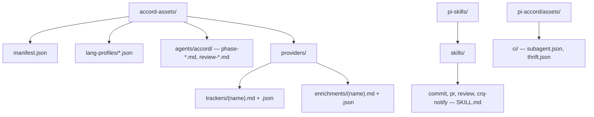

# Packaged ACCORD assets

Host-neutral prompt assets ship from **`packages/accord-assets/`**. Standalone Pi skills ship from **`packages/pi-skills/`**. Pi-only CI templates stay under **`packages/pi-accord/assets/`**.



Root `package.json` advertises agents via `pi.agents` → `packages/accord-assets/agents` and skills via `pi.skills` → `packages/pi-skills/skills/*`. Workflow routing lives in `packages/accord-core/src/orchestration/` (Pi and `accord` CLI).

## Installer

```bash
bun run install:assets
```

Links **accord-assets** (agents, providers, `default.md`) into `~/.config/pi/agent`. Refuses to replace locally modified files unless `--force`. Writes `.accord-assets.json` with manifest checksum.

Skills are **not** symlinked by this command — Pi loads them from `pi.skills` when you `pi install` the monorepo (or `pi install packages/pi-skills`).

Override roots: `ACCORD_ASSETS_DIR` (see `packages/accord-core/src/config/paths.ts`).

## Validation

```bash
bun run validate:assets
```

Runs:

1. `packages/accord-assets/scripts/validate-assets.ts` — agents ↔ registry ↔ schemas ↔ provider sidecars
2. `packages/pi-skills/scripts/validate-pi-skills.ts` — skills ↔ `package.json` `pi.skills`

## Agent registry

`packages/accord-core/src/agents/registry.ts` maps agent names to runtime behaviour. Bundled markdown: `packages/accord-assets/agents/accord/<name>.md`. Return schemas: `packages/accord-core/schemas/return-schemas/<name>.json`. See [`docs/extending.md`](extending.md).
