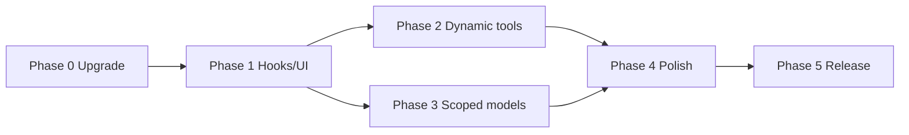

# Pi SDK upgrade — implementation plan

This document turns the Pi SDK 0.83 review into an **executable** roadmap: upgrade `@earendil-works/*` peers, adopt new extension APIs, and align model selection with Pi's scoped-model system. It is a living plan — update it as phases land.

**Related:** [`hooks-and-tools.md`](hooks-and-tools.md), [`harness-orchestration-implementation-plan.md`](harness-orchestration-implementation-plan.md), [`configuration.md`](configuration.md), [`local-development.md`](local-development.md).

---

## Goals

1. **Upgrade** peer dependencies from `@earendil-works/*` **0.75.3** to **0.83.x** (npm latest at plan time).
2. **Reduce prompt tokens** via dynamic `dev_*` tool activation without breaking MCP stdio parity.
3. **Improve orchestration timing** (`agent_settled`, compaction hints) and session transcript UX (entry renderers).
4. **Align model profiles** with Pi's `ctx.scopedModels` where it complements `subagent.json` (see `REFACTOR-Agents-model-profiles` branch work).

**Out of scope (for now):**

- Replacing child-process subagents with `createAgentSession` / in-process SDK sessions.
- `pi-accord-ci` SDK migration (`packages/pi-accord-ci/src/run-phase.ts` deliberately avoids SDK imports).

---

## Current state (baseline)

| Area | Today |
|------|--------|
| Pi peers | `^0.75.3` (`pi-agent-core`, `pi-ai`, `pi-coding-agent`, `pi-tui`) |
| Extension surface | `registerCommand`, `registerTool`, hooks (`tool_call`, `tool_result`, `session_start`, `turn_end`, `agent_end`, …), `promptSnippet`, `registerMessageRenderer`, `appendEntry`, `setWidget` |
| `dev_*` tools | **22** tools registered and **always active** in Pi |
| Subagent spawn | Isolated `pi --mode json` via `packages/pi-subagent` (`runSubagent`) — correct; `ExtensionAPI` has no generic tool executor |
| Model profiles | `subagent.json` profiles in `packages/pi-subagent` (parallel to Pi scoped models, not integrated) |

---

## Phase 0 — Baseline & upgrade gate

**Objective:** Clean 0.83 baseline before behaviour changes.

### Deliverables

1. Bump peer deps `@earendil-works/pi-agent-core`, `pi-ai`, `pi-coding-agent`, `pi-tui` → `^0.83.0` in root and workspace `packages/pi-*`.
2. Bump `typebox` → `^1.3.7` across workspace (0.83 removes deprecated TypeBox APIs).
3. Run full `npm run check` (test, biome, schemas, assets, types, bundle, runtime).
4. Manual smoke in Pi: package loads, `/dev help`, `/dev tasks`, one `/dev resume` orchestration spawn.

### Acceptance criteria

- `npm run check` green on branch.
- Pi starts with ACCORD registered; no extension load errors.
- README / [`local-development.md`](local-development.md) state minimum Pi **0.83.0** when peers require it.

### Risks

- Hook timing changes between 0.75 → 0.83. Keep Phase 1 diffs small until baseline is green.

### Status

- [x] Complete — peers `^0.83.0`, `typebox` `^1.3.7`, `npm run check` green, docs note Pi ≥ 0.83.0

---

## Phase 1 — Low-risk hook & UI wins

**Objective:** Small diffs, immediate UX/reliability gains, no workflow graph changes.

### 1a — `agent_settled` for end-of-run side effects

Pi 0.80.4+: `agent_end` fires when a loop ends; **`agent_settled`** fires when auto-retry, compaction, and queued continuations are finished.

| Change | From | To |
|--------|------|-----|
| Pending-decision notify | `agent_end` | `agent_settled` |
| Thrift output pruning | `agent_end` | `agent_settled` |

**Files:** `src/adapters/pi/pi-hook-listeners.ts`, `packages/pi-thrift/src/output.ts`

**Acceptance criteria**

- No pending-decision toast while auto-retry/compaction is still running.
- Thrift output level still persists; pruning runs after a fully settled turn.

### 1b — `registerEntryRenderer` for `appendEntry` markers

Pi 0.80.4+: display-only session entries (`CustomEntry`) render in interactive mode without entering model context.

| Entry `customType` | Renderer shows |
|--------------------|----------------|
| `dev-harness-run` | tag, run_id, work item ids, auto-provisioned flag |
| `thrift-output-level` | current output compression level |
| `pi-worktree` state | branch/path summary (if applicable) |

**Files:** `src/adapters/pi/hook-state.ts` (+ small renderer module), `packages/pi-thrift/src/index.ts`, `packages/pi-worktree/src/index.ts`

Keep `registerMessageRenderer` for **streaming** orchestrator spawn rows (`sendMessage` + live updates).

**Acceptance criteria**

- `/tree` and scrollback show styled harness-run entries (not raw JSON).
- `tests/dev-retro-harness-marker.test.ts` still passes.

### 1c — Compaction `reason` / `willRetry` in thrift

Pi 0.80.x: `session_before_compact` / `session_compact` include `reason: "manual" | "threshold" | "overflow"` and `willRetry`.

**File:** `packages/pi-thrift/src/compaction.ts`

**Logic**

- On `session_before_compact`: if `reason === "overflow"` and `willRetry`, skip or reduce compaction pre-processing.
- On `session_compact`: optionally log compaction `usage` from entry when present.

**Acceptance criteria**

- Manual `/compact` still reduces messages in place.
- Overflow recovery does not double-reduce turn prefix messages.

### 1d — `session_info_changed` → re-sync harness marker

**Files:** `src/adapters/pi/hook-state.ts` or `pi-hook-listeners.ts`

**Acceptance criteria**

- After session name changes, harness-run entry updates when tag/run_id context exists.

### Phase 1 exit

- All existing tests green.
- Add focused tests: entry renderer registration; compaction skip on overflow; `agent_settled` does not fire on mere `agent_end` without settle.

### Status

- [x] Complete — `agent_settled`, entry renderers, compaction overflow skip, `session_info_changed` harness sync

---

## Phase 2 — Dynamic tool activation (token win)

**Objective:** Cut system-prompt tool surface by activating `dev_*` tools on demand in the Pi adapter only.

### Design

1. **Register all tools** at startup (unchanged — MCP/stdio keeps full registry).
2. **Pi adapter:** call `setActiveTools()` after `session_start` with a **default active set**.
3. **Expand active set** when:
   - User runs `/dev` / `/accord` classify, resume, or finish orchestration.
   - `dev_bootstrap` succeeds (activate tools for that work item / phase).
   - Optional: shrink to core set on `session_start` or idle new work item.
4. **Fallback:** if model calls an inactive `dev_*` tool, auto-activate the matching bundle in `tool_call` preflight.

### Default active set (proposal)

**Core (always):** `dev_intent`, `dev_intent_enrich`, `dev_bootstrap`, `dev_resume_state`, `dev_work_item_status`, `dev_tasks`, `subagent`

**Phase bundles (activate on demand):**

| Bundle | Tools (representative) |
|--------|------------------------|
| spec | `dev_checkpoint`, `dev_spec_gaps`, `dev_transition`, `dev_finalize`, … |
| plan | `dev_checkpoint`, `dev_transition`, … |
| code | `dev_code_brief`, `dev_nonce`, `dev_quick_fix_brief`, `dev_verify_summary`, … |
| init | `dev_init_detect`, `dev_init_write` |
| meta | `dev_retro`, `dev_review_queue`, `dev_workflow_cost`, `dev_orchestrate`, `dev_rehydrate`, … |

Exact grouping should mirror `src/core/orchestration/` phase → agent mapping.

### Deliverables

| Task | File(s) |
|------|---------|
| Define `ACCORD_CORE_TOOLS` + phase bundles | `src/core/tools/active-set.ts` (new) |
| Apply `setActiveTools` on `session_start` | `src/adapters/pi/extension.ts` |
| Expand on orchestration phase | `src/adapters/pi/workflow-orchestration.ts`, `subagent/runtime-host.ts` |
| Expand on bootstrap | `pi-hook-listeners.ts` or tool wrapper |
| Feature flag `ACCORD_DYNAMIC_TOOLS=0` to disable | env guard |

### Acceptance criteria

- With flag on (default after bake-in): `getActiveTools()` excludes inactive `dev_*` before first `/dev resume`.
- Orchestration resume activates tools for current phase; spawns succeed.
- With flag off: behaviour identical to today (all tools active).
- Optional metric: log or test `getSystemPrompt()` tool-section size before/after.

### Risks

- Model calls tool not yet activated → fallback auto-activate + clear error message.
- Cache-friendly dynamic loading (0.80.7) helps Anthropic/OpenAI Responses users; others still benefit from smaller active set.

### Status

- [x] Complete — dynamic tool bundles, `setActiveTools` on session_start, expand on orchestration/bootstrap, `ACCORD_DYNAMIC_TOOLS=0` opt-out

---

## Phase 3 — Scoped models + profile alignment

**Objective:** Bridge `subagent.json` profiles with Pi's `ctx.scopedModels` (0.83).

### 3a — Orchestration judgment model selection

**File:** `src/adapters/pi/subagent/judgment.ts`

**Precedence**

1. `orchestration.judgment.model` in harness config (unchanged).
2. Lightweight match from `ctx.scopedModels` for `completeSimple`.
3. Fall back to `ctx.model` (today).

**Acceptance criteria**

- Judgment runs without session main model when scoped lightweight exists.
- Template fallback unchanged when judgment skipped.

### 3b — Preflight surfaces scoped models

**Files:** `src/core/queries/subagent-preflight.ts`, Pi adapter if needed

Add to preflight payload when host provides them:

- `scoped_models`: `{ provider, modelId, thinkingLevel? }[]`
- Note when `subagent.json` profile diverges from scoped list

**Acceptance criteria**

- `dev_subagent_preflight` includes scoped models in Pi (empty on stdio MCP).

### 3c — Document profile layering

**File:** [`configuration.md`](configuration.md) (short section)

**Precedence**

1. Agent frontmatter `model:` pin
2. `subagent.json` `agentProfiles` / `reviewProfile` / skill profile
3. Pi scoped models / `enabledModels` (reference; not auto-sync in Phase 3)
4. `defaultProfile` tiers

**Optional follow-up:** map `subagent.json` tier entries to scoped model patterns instead of hard-coded provider/model strings.

### Status

- [ ] Not started

---

## Phase 4 — Polish & observability

| Item | Where | Priority |
|------|-------|----------|
| `promptGuidelines` on high-traffic tools | `src/adapters/pi/tools.ts` or registry metadata | Medium |
| `before_provider_headers` — inject run / work-item correlation headers | `pi-hook-listeners.ts` | Low |
| `setWorkingVisible(false)` during orchestrator spawn | `spawn-status.ts` | Low |
| `xhigh` / `max` thinking in subagent profiles + agent frontmatter | `packages/pi-subagent`, `assets/agents` | Medium |
| README: `compat.sessionAffinityFormat` for OpenRouter | `README.md` | Low |

**Acceptance criteria**

- Spawn UI: no duplicate default loader + custom widget.
- Review agents with `thinking: xhigh` spawn on supported models.

### Status

- [ ] Not started

---

## Phase 5 — Docs, flags, and release

### Deliverables

- Update [`hooks-and-tools.md`](hooks-and-tools.md) — `agent_settled`, entry renderers, dynamic tools.
- Update [`local-development.md`](local-development.md) — require Pi ≥ 0.83.
- Changelog / release notes for package consumers.
- Default `ACCORD_DYNAMIC_TOOLS=1` after Phase 2 bake-in (if not already default).

### Status

- [ ] Not started

---

## Sequencing

| Phase | Effort (rough) | Value |
|-------|----------------|-------|
| 0 | 0.5–1 day | Required |
| 1 | 1–2 days | Reliability + UX |
| 2 | 2–3 days | High token savings |
| 3 | 1–2 days | Aligns with model-profiles branch |
| 4 | 1 day | Nice-to-have |
| 5 | 0.5 day | Ship |

### Recommended PR split

1. `chore: bump pi SDK to 0.83` (Phase 0 only)
2. `feat: agent_settled, entry renderers, compaction hints` (Phase 1)
3. `feat: dynamic dev_* tool activation` (Phase 2)
4. `feat: scoped models in judgment + preflight` (Phase 3)
5. `chore: polish + docs` (Phase 4–5)

---

## Test strategy

| Area | Tests |
|------|-------|
| Upgrade | Existing suite + `check:bundle` |
| Entry renderers | Renderer registration unit test; `dev-retro-harness-marker` unchanged |
| `agent_settled` | Mock sequence: notify only after settle, not on bare `agent_end` |
| Dynamic tools | Active-set resolver unit test; tool_call fallback activates bundle |
| Scoped models | Mock `ctx.scopedModels` in judgment test |
| Compaction | Thrift: overflow + `willRetry` skips reduction |

---

## Open decisions

Resolve before Phase 2–3 land:

| # | Question | Options |
|---|----------|---------|
| 1 | Default dynamic tools | On by default after Phase 2 bake-in vs opt-in via env until proven |
| 2 | Tool bundle granularity | Per-phase vs per-pattern (`quick_fix` vs full pipeline) |
| 3 | Scoped models vs `subagent.json` | Reference-only in Phase 3 vs auto-map tiers to scoped patterns in same release |
| 4 | MCP parity | Stdio MCP keeps all tools active always (recommended) — confirm |

---

## SDK features considered but deferred

| Feature | Reason to defer |
|---------|-----------------|
| `createAgentSession` + `InMemorySessionStorage` | CI and subagent path intentionally use child `pi` processes |
| RPC `get_entries` / `get_tree` | Nice for `dev_retro` enrichment; not blocking upgrade |
| `pi auth print-api-key` | CI credential export; separate from extension work |
| Built-in tool render overrides | Custom read/write display for artifact paths — polish only |
| `InlineExtension` typing | Package.json ergonomics only |
