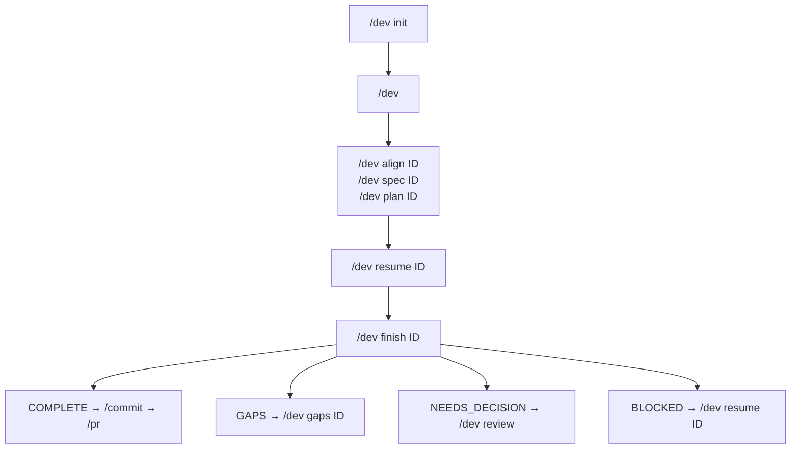
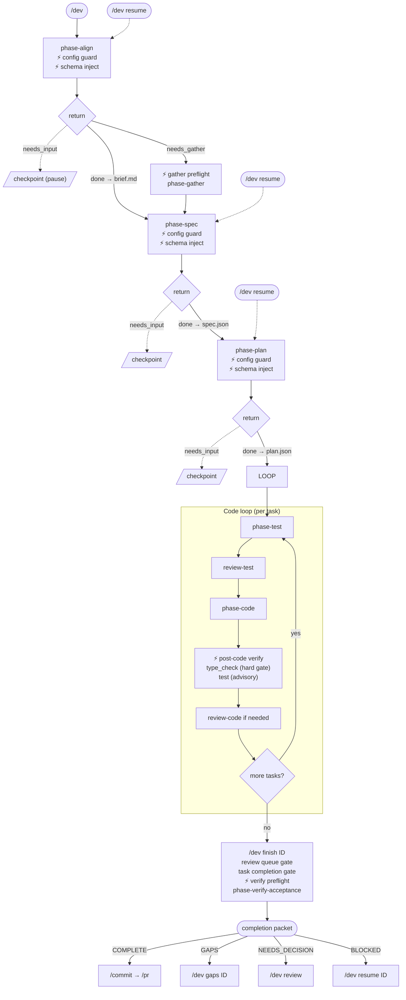
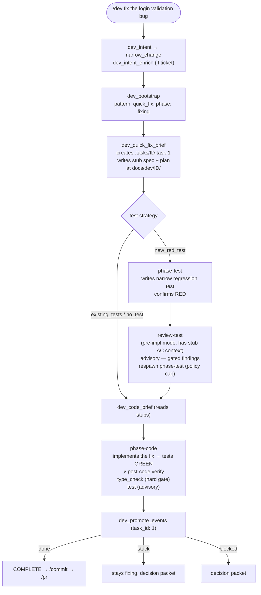
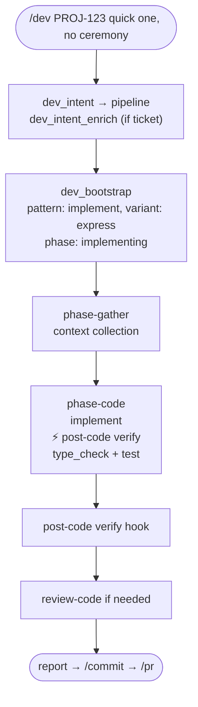
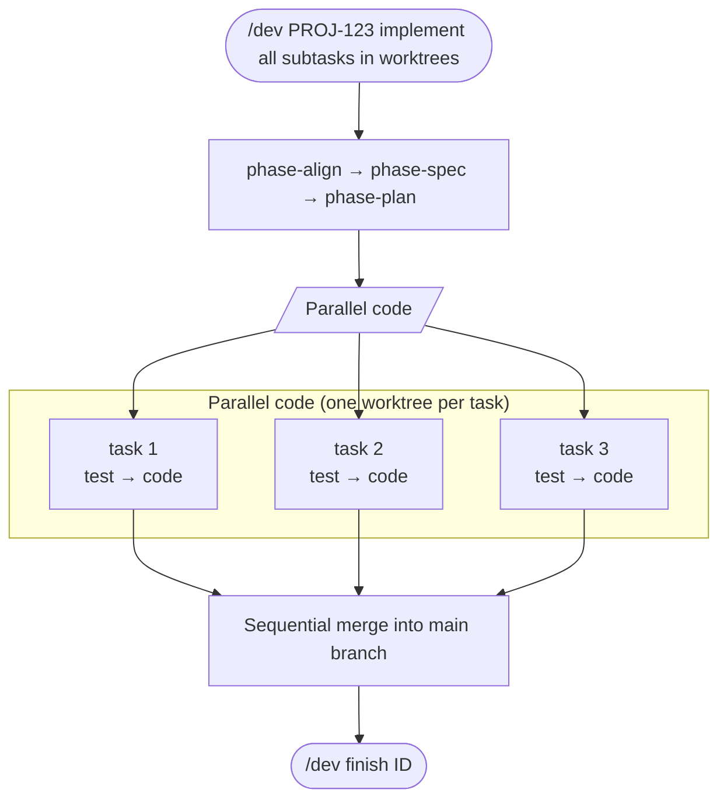
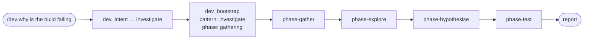
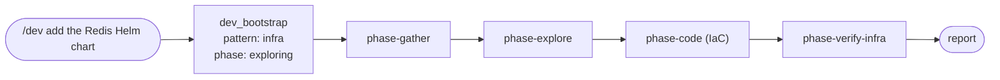
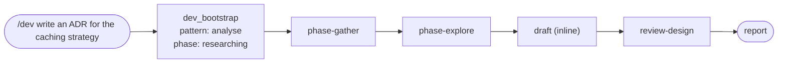

# Pipeline and command flow

## Command flow

The `/dev` autocomplete and help output list subcommands in the order a developer usually calls them, favouring the happy path:



Optional: `/dev check <ID>` reruns lower-level acceptance checks without finalizing the work item.

The canonical subcommand order is:

```
init → align → spec → plan → resume → rehydrate → finish → check → gaps → review → deviations → amend-spec → spec-gaps → tasks → retro → tag → help
```

## Pipeline

The `implement/standard` pipeline. Hooks fire at marked points (`⚡`). Dotted lines are user-pause boundaries.



### Quick fix (`quick_fix`)

For bounded, low-ceremony changes. Skips align, spec, and plan. When the test strategy is `new_red_test`, `phase-test` and `review-test` run before `phase-code` — preserving adversarial test/impl separation.



Single task only (`task_id: "1"`). Auto-generated spec/plan stubs give review agents AC coverage context without running the full spec/plan agents. The extension's post-code verification is the only hard gate.

### Express (`implement/express`)

For work that needs implementation rigour but not the full interview pipeline. Skips align, spec, and plan.



### Orchestrated (`implement/orchestrated`)

For tickets with 3+ parallelisable tasks. Same spec/plan as standard, but code runs in parallel worktrees.



### Investigate (`investigate`)

Read-only diagnosis first. Edits require confirmation.



### Infrastructure (`infra`)

For Terraform, Helm, Kubernetes, Pulumi, and CloudFormation work.



### Analyse (`analyse`)

For design docs, ADRs, and option comparisons. No code is produced.



### Pattern selection

The orchestrator selects a pattern via `dev_intent` (keyword heuristics) optionally refined by `dev_intent_enrich` (ticket metadata):

| Cue | Pattern | Variant |
|-----|---------|--------|
| "add / implement / build / feature" with ticket | `implement` | `standard` |
| same but "quick one", "no ceremony" | `implement` | `express` |
| 3+ parallelisable tasks + worktrees requested | `implement` | `orchestrated` |
| "fix a typo / one-line / rename" or target path | `quick_fix` | — |
| "why / root cause / investigate" | `investigate` | — |
| Terraform / Helm / Kubernetes / Pulumi | `infra` | — |
| "ADR / design doc / compare options" | `analyse` | — |

When confidence is medium/low and a ticket ID is present, `dev_intent_enrich` fetches the ticket and can upgrade (`narrow_change` → `pipeline`) or downgrade (`pipeline` → `narrow_change`) based on AC count, story points, subtasks, and description length.

All pipelines share the same hooks. `/dev finish <ID>` is the developer-facing post-implementation command; `/dev check <ID>` is the lower-level acceptance verification step.

## Harness orchestration

The diagrams above reflect **current** behaviour: deterministic hooks plus the **core orchestrator** (`src/core/orchestration/`) driving `/dev` workflow subcommands via programmatic `subagent` spawns (default on; set `ACCORD_CORE_ORCHESTRATOR=0` to disable). The Pi adapter implements host ports (`spawnSubagent`, optional `runJudgment`) in `src/adapters/pi/subagent/`. See [`harness-orchestration.md`](harness-orchestration.md) for design rationale and [`harness-orchestration-implementation-plan.md`](harness-orchestration-implementation-plan.md) for delivery history. **Stdio MCP** consumers use the **`dev_orchestrate`** tool for the same `resolution` / `next_steps` JSON as Pi (without programmatic spawn or judgment LLM); see [`hooks-and-tools.md`](hooks-and-tools.md).
