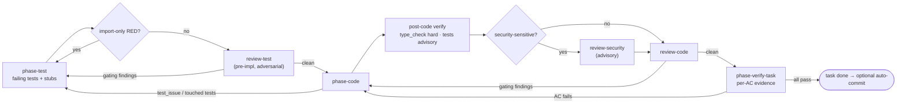

# Per-task loop

Each arrow back is a new round on the task file (`T<n>`, `C<n>`, `V<n>`), and each loop has its own
cap (`test_review`, `code_review`, `rgr`, `verify`); at a cap the task blocks for a human.

Rules:

- `phase-test` writes tests (and declares unimplemented stubs); `phase-code` **never writes tests** and must replace stubs. A violation becomes a test-loop finding and respawns `phase-test` (RGR).
- Import/resolution-only RED (`Cannot find module`, `ModuleNotFoundError`, …) is detected deterministically and raised as a critical `import_only_red` finding by `<round>/harness`; it consumes a review-test retry slot so caps still trip.
- Every finding has a stable `F-nnn` id under its AC. Fixers answer by id (`fixed | disputed | wont_fix`); the raising reviewer rechecks by id (`verified | reraised | dispute_upheld | wont_fix_accepted`). Retry briefs render the open findings with their history — see [Per-task file](/references/task-file.md).
- An AC is `satisfied` only from phase-verify-task `evidence[]`; review-security findings are advisory.
- Retry caps and severity gates come from [Orchestration policy](/references/orchestration-policy.md). On cap, task goes `blocked`; see [Unblock a task](/playbooks/unblock-a-task.md).

# Acceptance verification

`/dev finish <ID>` → verify preflight (staleness + `verification_commands`) →
`phase-verify-acceptance` → `dev_verify_summary` (writes `verify.md`) → `dev_finalize` (terminal
outcome, `workflow-cost.json`).

| AC type | Verified by |
|---------|-------------|
| `scenario` (Given/When/Then) | Test mapped to AC ID |
| `constraint` | Runtime assertion / perf test |
| `architectural` | Lint/enforcement rule |
| `property` | Property-based test (future) |

`verify.json` verdict is `pass` or `gaps`; gaps are derived from failing `criteria[]` at render
time (no separate array). `/dev gaps <ID>` lists them; `--tickets` spawns `phase-gaps`.
