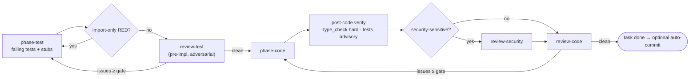

# Per-task loop

Rules:

- `phase-test` writes tests (and declares unimplemented `stub_files`); `phase-code` **never writes tests** and must replace stubs. A violation respawns `phase-test`.
- Import/resolution-only RED (`Cannot find module`, `ModuleNotFoundError`, …) is detected deterministically and bounced back as a synthetic critical `import_only_red` finding; it consumes a review-test retry slot so caps still trip.
- Retry briefs carry `prior_round` (test files, stubs, output); `phase-test` must answer each finding in `review_responses`. Feedback is injected only from the active task.
- Retry caps and severity gates come from [Orchestration policy](/references/orchestration-policy.md). On cap, task goes `blocked`; see [Unblock a task](/playbooks/unblock-a-task.md).

# Acceptance verification

`/dev finish <ID>` → verify preflight (staleness + `verification_commands`) →
`phase-verify-acceptance` → `dev_verify_summary` (writes `verify.md`) → `dev_finalize` (terminal
outcome, `workflow-cost.json`).

| AC type | Verified by |
|---------|-------------|
| `scenario` (Given/When/Then) | Test mapped to AC ID |
| `constraint` | Runtime assertion / perf test |
| `architectural` | Lint/enforcement rule |
| `property` | Property-based test (future) |

`verify.json` verdict is `pass` or `gaps`; gaps are derived from failing `criteria[]` at render
time (no separate array). `/dev gaps <ID>` lists them; `--tickets` spawns `phase-gaps`.
