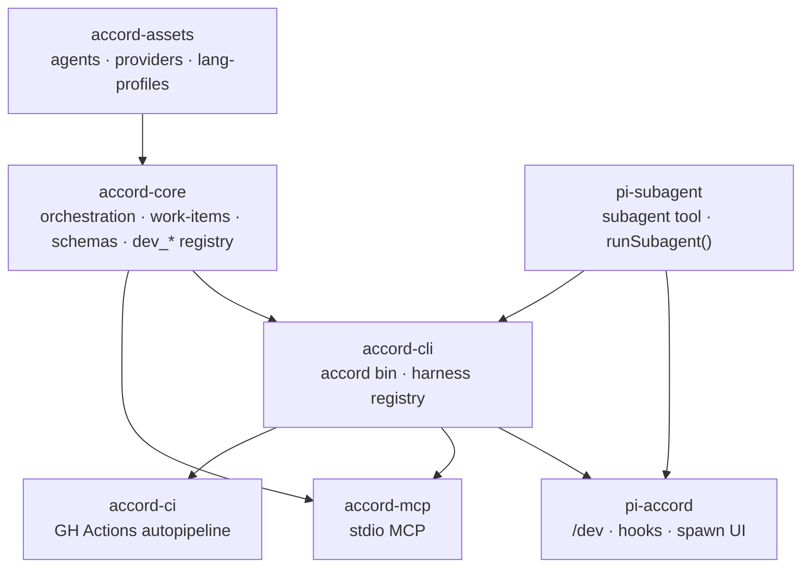

# Layering

Rule: orchestration and domain logic live in **`accord-core`** and stay host-neutral. Adapters
(`pi-accord`, `accord-mcp`) only map host events/tools onto core callables. Pi-specific APIs
never enter `accord-core`.

# Packages

| Package | npm name | Owns |
|---------|----------|------|
| `packages/accord-core` | `@clive.shirley/accord-core` | Orchestration (`src/orchestration/`), work items (`work-items/`), artifacts + validation, briefing, Crucible (`verification/`), harness hook callables (`harness/`), subagent prepare/result pipeline, standalone review, `dev_*` tool registry, config/detect, telemetry, **schemas/** |
| `packages/accord-cli` | `@clive.shirley/accord-cli` | `accord` bin, argv parsing, commands (`resume`, `finish`, `drive`, `run`, `block`, …), harness backends (`pi`, `exec`, claude/cursor presets) |
| `packages/accord-mcp` | `@clive.shirley/accord-mcp` | Stdio MCP server exposing the same `dev_*` tools; `ACCORD_MCP_HARNESS` execution |
| `packages/accord-ci` | `@clive.shirley/accord-ci` | Autopipeline scripts + contract tests for `.github/workflows/autopipeline.yml` |
| `packages/accord-assets` | `@clive.shirley/accord-assets` | Agent markdown (`agents/accord/*.md`), providers, lang-profiles, `manifest.json`, asset validator |
| `packages/pi-accord` | `@clive.shirley/pi-accord` | Pi extension: `/dev` command, autocomplete, hook listeners, `cli-client.ts`, spawn bridge + UI, status bar, CI templates under `assets/` |
| `packages/pi-subagent` | `@clive.shirley/pi-subagent` | `subagent` tool; `runSubagent()` / `spawnSubagent()` child `pi` processes; agent discovery; `subagent.json` profiles |
| `packages/pi-git` | `@clive.shirley/pi-git` | `git_commit_*`, `gh_pr_*`, `gh_ci_context`, `git_review_*`, `repo_verify`, `wt_*`, `/wt` |
| `packages/pi-thrift` | `@clive.shirley/pi-thrift` | Input/output token pruning, `/thrift` (`/tp`), `thrift_recall` |
| `packages/pi-integrations` | `@clive.shirley/pi-integrations` | Jira, Slack, Gmail, Calendar tools (`defineTool()` defs) |
| `packages/pi-skills` | `@clive.shirley/pi-skills` | Standalone skills: `commit`, `pr`, `review`, `verify`, `worktree`, `ci-debug`, `session-retro`, `crq-notify` |

# Pi manifest

Root `package.json` → `pi.extensions` loads, in order: `pi-subagent`, `pi-thrift`, `pi-git`,
`pi-integrations`, `pi-accord`. `pi.skills` points at `packages/pi-skills/skills/*`;
`pi.agents` at `packages/accord-assets/agents`. One `pi install <repo>` registers all of them.
See [Local development setup](/playbooks/local-development-setup.md).

# Runtime directories

| Path | Committed | Purpose |
|------|-----------|---------|
| `docs/dev/<ID>/` | yes | Contract artifacts per work item |
| `.tasks/` | no | Transient work-item, checkpoint, task, usage state |
| `~/.config/accord/accord.json` | — | Global harness backends/tiers ([config](/references/dev-harness-config.md)) |
| `~/.config/pi/agent/` | — | Linked assets, `subagent.json`, Pi settings |

See [Artifacts and state](/references/artifacts-and-state.md).
