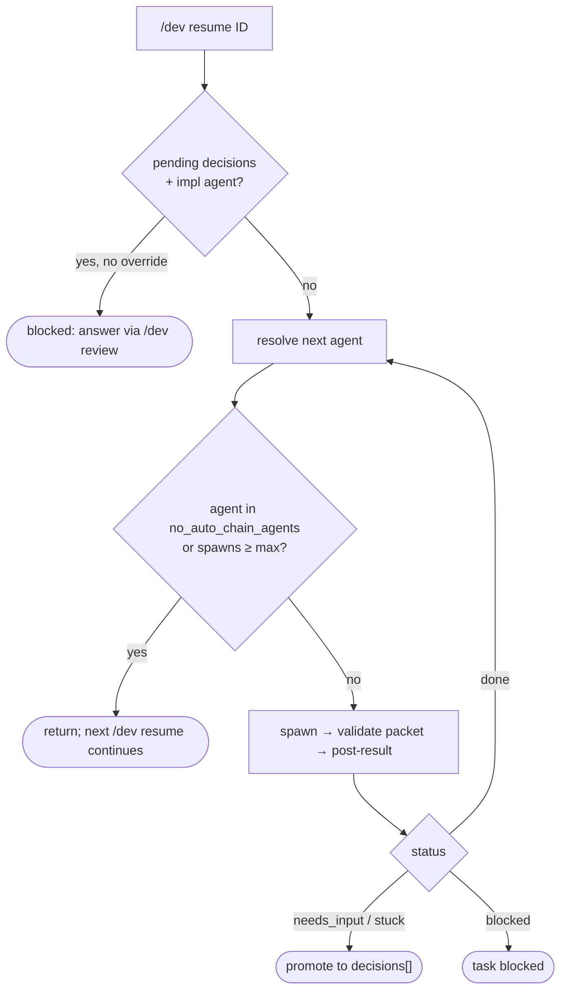

# Summary

Routing lives in **`packages/accord-core/src/orchestration/`**, not in a model or skill. The
previous skill-as-orchestrator design was removed; the main-session model no longer chooses
`subagent({ agent })` names. Inputs are work-item state, checkpoints, pattern/variant, and
validated return packets; output is the next allowed step (spawn a registered agent, run
internal `dev_*` steps, or pause for user input).

`ACCORD_CORE_ORCHESTRATOR` defaults on. Setting `0`/`false`/`off` disables programmatic spawns
and leaves only local handlers and in-session tools — not recommended.

# Components

| Module | Role |
|--------|------|
| `resolve/` | Pure resolution: which agent `/dev resume` / `finish` / forced subcommands (`align`, `spec`, `plan`, `check`) should run, via registry IDs and coarse phase map (`phase-coarse-routing.ts`) |
| `plan.ts` | Resolution → `next_steps` payload; same JSON as `dev_orchestrate` and `accord plan --json` |
| `runner.ts` | Executes steps against an `OrchestrationRuntimeHost`; `runResumeOrchestrationWithReplans` replans after each successful spawn; `runFinishOrchestration` spawns `phase-verify-acceptance`, schema-checks `verify.json`, then `dev_verify_summary` → `dev_finalize` → closeout commit |
| `post-result/` | One handler per agent (`phase-align`, `phase-spec`, `phase-plan`, `phase-test`, `phase-code`, `phase-verify-*`, `review-test`, `review-code`, `review-security`) plus universal `needs-input.ts` and `stuck.ts` |
| `policy.ts` | Retry caps, severity gates, resume chaining limits — see [Orchestration policy](/references/orchestration-policy.md) |
| `pending-decisions-gate.ts` | Blocks implementation agents while `decisions[]` has pending entries |
| `test-red-classification.ts` | Detects import-only RED in `phase-test` output and bounces back without spending a `review-test` spawn |
| `judgment.ts` | Optional bounded LLM supplement (Pi only); validated against `orchestration-judgment-packet.json`, cannot carry routing fields |
| `commit-on-task-done.ts` | Per-task commit for every `done` task (swept after each subagent result by core `processSubagentToolResult`, all hosts) and the closeout commit of `docs/dev/<ID>/` |
| `graph.ts`, `guards.ts`, `interpreter.ts` | Declarative graph + guard registry; reference graph validated in CI |

# Host ports

`host.ts` defines what adapters implement:

- `OrchestrationHost` — `cwd`, `signal`, `notify`, `confirm`, `availableToolNames()` (gather preflight).
- `OrchestrationRuntimeHost` — `notify` + `spawnSubagent({ agent, task })` + optional `runJudgment`.

Implementations: Pi (`packages/pi-accord/src/subagent/runtime-host.ts`), CLI harnesses
(`packages/accord-cli/src/harnesses/as-runtime-host.ts`), MCP (`mcp-orchestrate-host.ts`), and
test fakes. Adapters hold no workflow graph.

# Resume loop

Defaults: stop before `phase-code` (`no_auto_chain_agents: ["phase-code"]`), max 8 spawns per
command. `stuck` is a universal stop — promoted to `decisions[]` and CLI exits with code 2.

# Status routing

Return-packet `status` drives transitions: `done` advances, `needs_input` enters the multi-turn
interview loop (checkpoint + `decisions[]`), `stuck` escalates, `blocked` halts the task. Review
agents use `verdict` (`clean` / `issues`); gated `issues` send work back to the producing agent
until retry caps trip. See [Crucible verification](/architecture/crucible-verification.md).

# Workflow state ownership

Work-item, per-task, and checkpoint JSON under `.tasks/` are **orchestrator-owned**. Agents
return structured data (including `events[]`) in their packet; post-result handlers apply it.
`harness/workflow-state-write-guard.ts` blocks agent writes to those paths unless
`ACCORD_ALLOW_AGENT_WORKFLOW_WRITES=1` (legacy). Task read-modify-write uses `withJsonFileLock`.
