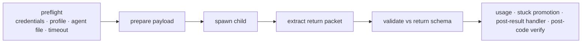

# Isolation model

Every phase and review agent is a **fresh process** with its own context window. The parent
session never accumulates phase context; continuity comes only from disk (work item,
checkpoint, artifacts) and the brief. `pi-subagent` exposes:

- `subagent` tool — single / parallel / chain modes for interactive use.
- `runSubagent()` (`src/api.ts`) — programmatic await with timeout, abort signal, and lifecycle events. ACCORD orchestration calls this with `timeoutMs: 0` (no wall-clock limit).

# Spawn pipeline



Prepare (`accord-core/src/subagent/prepare.ts`, `payload.ts`) sets:

| Field | Content |
|-------|---------|
| `agentFile` | Absolute path to `accord-assets/agents/accord/<agent>.md` |
| `systemAppend` | `## Project Stack` from Dev Harness config + intent-contract brief |
| `response` | Return-schema contract; pi-subagent appends schema text + validated examples |
| `task` | Role-specific brief (see `briefing/`) |

Result (`subagent/result/`): prefer `parsedReturn` from `runSubagent`, else the last fenced
` ```json ` block in the final assistant message. Validation uses the schema mapped in
`agents/registry.ts`. `stuck` packets are promoted to `decisions[]` even if other validation
fails.

# Harness backends

The CLI (and MCP with `ACCORD_MCP_HARNESS`) routes spawns through a harness registry
(`accord-cli/src/harnesses/registry.ts`):

| ID | Implementation | Notes |
|----|----------------|-------|
| `pi` | `pi-exec.ts` | `pi --mode json -p` via pi-subagent; `subagent.json` profile resolution |
| `claude` | `claude-code-exec.ts` preset | `claude -p`; body → `--system-prompt`, stack → `--append-system-prompt`; `ACCORD_CLAUDE_SKIP_PERMISSIONS` opt-in |
| `cursor` | `cursor-agent-exec.ts` preset | `agent --print`; frontmatter resolved via `subagent.json`, not passed as argv |
| `exec` | `exec.ts` | Generic subprocess template with `{{agentId}}`, `{{taskFile}}`, `{{systemAppendFile}}`, `{{cwd}}`, … tokens |

Per-agent backend/model comes from agent frontmatter `tier:` mapped through
`harness.tiers` in `~/.config/accord/accord.json`. See [Dev Harness config](/references/dev-harness-config.md).

# Pi as client

Pi `/dev resume|finish|<phase>` delegates to `@clive.shirley/accord-cli` via
`packages/pi-accord/src/cli-client.ts` — in-process by default (full TUI spawn widgets), or
subprocess with `ACCORD_CLI_DELEGATE=subprocess` (`ACCORD_CLI_BIN` overrides the script).
