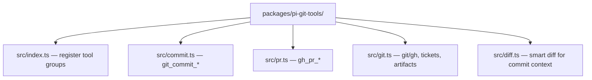

# git-tools

Pi extension that exposes **`git_commit_*`** and **`gh_pr_*`** tools so the agent can gather repo context, stage safely, commit with a structured message, and push or open GitHub pull requests — without ad-hoc shell glue.

## Why

Commit and PR flows repeat the same steps: status, diff, branch, ticket hints, secret checks, then `git add` / `git commit`, or PR context plus `gh pr create`. These tools wrap that in typed, review-friendly payloads (including suggested staging paths with secrets excluded) so skills like `commit` and `pr` can stay thin playbooks.

## Tools

| Tool | Description |
|------|-------------|
| `git_commit_context` | One-shot context: status, diff, recent log, branch, inferred ticket hints, secret scan warnings, dev artifacts, suggested files to stage |
| `git_commit_execute` | Stage a caller-provided file list and commit with a given message (after human confirmation in the skill flow) |
| `gh_pr_context` | Branch vs default remote, existing PR if any, commits summary, diffstat, optional spec/verify snippets, `gh auth` state |
| `gh_pr_submit` | Push current branch and create or update a PR via the GitHub CLI |

## Requirements

- **Git** — repository operations assume a normal git working tree.
- **`gh`** — PR tools need the [GitHub CLI](https://cli.github.com/) installed and authenticated (`gh auth login`).

## Installation

When you use **`@clive.shirley/pi-accord`**, this package is already listed in the root `package.json` → `pi.extensions` after the other bundled extensions.

To load only this entry for smoke testing:

```bash
pi -e "$(pwd)/packages/pi-git-tools/src/index.ts"
```

## Architecture



This package does not register slash commands; it is tool-only. Pair it with bundled skills under `assets/skills/commit` and `assets/skills/pr` in the pi-accord repo for guided workflows.
