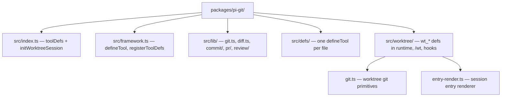

# pi-git

Pi extension for git workflows: **`git_commit_*`**, **`gh_pr_*`**, **`git_review_context`**, **`wt_*`**, and **`/wt`**.

## Why

Commit and PR flows repeat the same steps: status, diff, branch, ticket hints, secret checks, then `git add` / `git commit`, or PR context plus `gh pr create`. Git worktrees add parallel branches in isolated directories. These tools and commands wrap that in typed payloads and session state so skills like `commit` and `pr` stay thin, and agents can manage worktrees without shell glue.

## Commit / PR / review tools

| Tool | Description |
|------|-------------|
| `git_commit_context` | One-shot context: status, diff, recent log, branch, inferred ticket hints, secret scan warnings, dev artifacts, suggested files to stage |
| `git_commit_execute` | Stage a caller-provided file list and commit with a given message (after human confirmation in the skill flow) |
| `gh_pr_context` | Branch vs default remote, existing PR if any, commits summary, diffstat, optional spec/verify snippets, `gh auth` state |
| `gh_pr_submit` | Push current branch and create or update a PR via the GitHub CLI |
| `git_review_context` | Standalone review ladder (staged → unstaged → branch); writes full diff to a temp file and returns `diff_path`, `file_list`, and test hints |
| `git_review_tasks` | Build `tasks[]` for `subagent` (review-code, review-security, optional review-test) — used by the `/review` skill; not `accord review` |

## Worktrees

| Tool | Description |
|------|-------------|
| `wt_create` | Create a worktree with its own branch for isolated work |
| `wt_list` | List all active worktrees with branch, path, status |
| `wt_status` | Detailed status: uncommitted changes, ahead/behind, diffstat |
| `wt_merge` | Merge a worktree's branch back and clean up |
| `wt_remove` | Remove a worktree without merging |
| `wt_exec` | Run a shell command inside a worktree's directory |
| `wt_pr` | Push a worktree's branch and open/update a PR via `gh` |

### `/wt` command

| Subcommand | Action |
|---|---|
| `create <name> [base]` | Create worktree + branch `wt/<name>` from base |
| `list` or (empty) | List active worktrees |
| `status [name]` | Status summary (all or specific) |
| `merge <name> [into]` | Merge branch into base, remove worktree |
| `remove <name>` | Remove worktree (confirms if dirty) |
| `pr <name> [--draft]` | Push + open/update PR |
| `cleanup` | Remove all worktrees |
| `help` | Show usage |

Worktrees live under `.worktrees/<name>` (auto-gitignored). Branches use the `wt/<name>` prefix. Metadata is persisted in session state and reconciled on startup. Pair with the `subagent` tool and `cwd` set to a worktree path for parallel work.

## Requirements

- **Git** — repository operations assume a normal git working tree.
- **`gh`** — PR tools need the [GitHub CLI](https://cli.github.com/) installed and authenticated (`gh auth login`).

## Installation

When you use the **`@clive.shirley/accord`** monorepo, this package is already listed in the root `package.json` → `pi.extensions`.

To load only this entry for smoke testing:

```bash
pi -e "$(pwd)/packages/pi-git/src/index.ts"
```

## Architecture



Pair commit/PR tools with bundled skills under `packages/pi-accord/assets/skills/commit` and `pr`.
