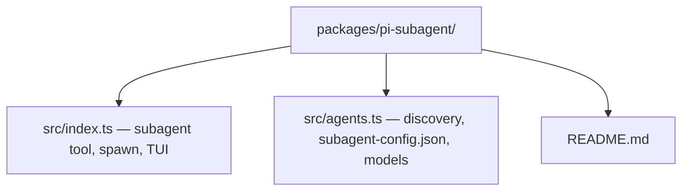

# subagent

Pi extension that registers a single **`subagent`** tool. Each invocation spawns a **separate `pi` child process** with a fresh context window, runs a named agent markdown definition to completion, and returns structured text (JSON mode) to the parent session.

## Why

Long harness runs (spec → plan → code → verify) blow up context if everything shares one window. Delegating phases or reviews to subagents keeps the parent transcript small while still using full agent prompts, tools, and model config per sub-task.

## Modes

Exactly **one** mode per call:

| Mode | Parameters | Behaviour |
|------|--------------|-----------|
| **Single** | `agent`, `task`, optional `cwd` | One child, one agent, one task |
| **Parallel** | `tasks: [{ agent, task, cwd? }, ...]` | Multiple children (bounded concurrency); results aggregated |
| **Chain** | `chain: [{ agent, task, cwd? }, ...]` | Sequential children; later `task` strings may include `{previous}` replaced with the prior step's output |

## Agent discovery

- **Default** (`agentScope: "user"`): agents under the user Pi config (e.g. `~/.pi/agent/agents`), same layout Pi uses elsewhere.
- **Project** (`"project"`): repo-local definitions (e.g. `.pi/agents`).
- **Both** (`"both"`): union of user + project; project agents can trigger a UI confirm when `confirmProjectAgents` is true (default).

Per-task **`cwd`** runs the child `pi` process with that working directory — use this with [worktree](../pi-worktree/README.md) paths for parallel branches.

## Configuration

Model and provider defaults for subagents are driven by **`subagent-config.json`** next to the discovered agent roots, with fallbacks documented in `src/agents.ts` (profiles, tiers, skill-namespace overrides). Agent markdown may pin a model in frontmatter.

## Limits (sensible defaults)

Parallel fan-out is capped (max tasks and concurrency are enforced in code) so a single orchestration step cannot fork unbounded processes.

## Installation

Bundled with **`@clive.shirley/pi-accord`** via root `package.json` → `pi.extensions` (this entry is registered **before** the ACCORD harness so orchestration skills can call `subagent` reliably).

To smoke-test the extension file alone:

```bash
pi -e "$(pwd)/packages/pi-subagent/src/index.ts"
```

## Architecture



Orchestration prompts (for example ACCORD phase agents) live in the parent package's `assets/agents/` tree; this extension only runs whatever agent names you pass in.
