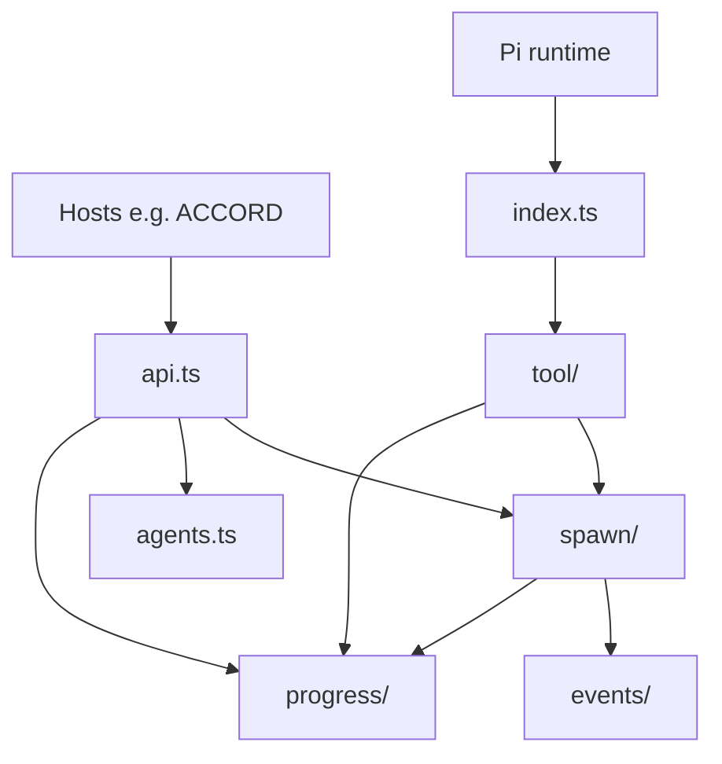

# pi-subagent source layout

Two entry surfaces:

| Entry | Use when |
|-------|----------|
| [`api.ts`](./api.ts) | Programmatic spawns from ACCORD or other hosts (`runSubagent`, agents, progress) |
| [`index.ts`](./index.ts) | Pi extension only (registers the `subagent` tool) |

## Modules

```
src/
├── api.ts                    # Public API barrel (import this from hosts)
├── index.ts                  # Pi extension entry (thin)
│
├── spawn/                    # Isolated child `pi` process
│   ├── types.ts              # Request/result/event types
│   ├── resolve.ts            # Agent + model resolution
│   ├── output.ts             # Final assistant text extraction
│   ├── child.ts              # spawnSubagent
│   ├── run.ts                # runSubagent (timeout + lifecycle events)
│   └── abort.ts              # Signal merging
│
├── events/                   # Pi JSON stream from child stdout
│   └── handle.ts             # handleSubagentJsonEvent
│
├── progress/                 # Live activity + summaries
│   ├── activity-buffer.ts
│   ├── messages.ts
│   ├── summarize.ts
│   └── …
│
├── tool/                     # Pi `subagent` tool (TUI + execute)
│   ├── params.ts             # Typebox schemas
│   ├── execute.ts            # single / parallel / chain
│   ├── render.ts             # Tool call/result UI
│   └── register.ts           # extension default export
│
├── agents.ts                 # Discovery + subagent.json profiles
├── agent-load.ts             # Load agent .md by path
├── response-contract.ts      # JSON/schema response appendix
└── subagent-tool-renderers.ts # Optional TUI renderer hooks
```

## Dependency flow


