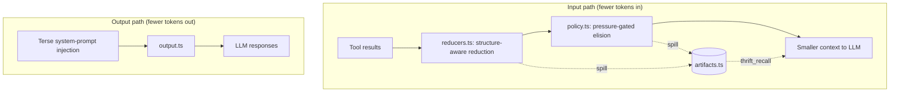

# thrift

A [pi](https://pi.dev) extension that reduces token usage on **both sides** of
the conversation — fewer tokens in, fewer tokens out.

The guiding rule is that compression should not cost fidelity. Two things make
that possible: nothing is elided until the context window is actually under
pressure, and everything that is elided stays recoverable through
`thrift_recall`.

## How it works



| Module | Role |
|--------|------|
| `reducers.ts` | Pure text reduction — code skeletons, log folding, list trimming |
| `policy.ts` | Pure decisions — what to elide, and under how much pressure |
| `artifacts.ts` | Spill store and the `thrift_recall` tool |
| `input.ts` | Wires the above into the `tool_result` and `context` hooks |
| `compaction.ts` | Feeds pi's summariser reduced input |
| `output.ts` | Terse-mode system prompt |

`reducers.ts` and `policy.ts` are pure and dependency-free, so the interesting
behaviour is testable without a live session.

## Installation

When developing this repo, thrift is loaded via `@clive.shirley/pi-accord`
(`package.json` → `pi.extensions`).

To test the thrift entry file in isolation:

```bash
pi -e "$(pwd)/packages/pi-thrift/src/index.ts"
```

## Commands

All commands live under `/thrift` (alias `/tp`):

```
/tp                     Quick status overview
/tp on|off              Enable or disable the entire extension
/tp stats               Detailed statistics for this session
/tp output [level]      Set output compression (toggle if no arg)
/tp input [on|off]      Toggle input pruning
/tp reduce [on|off]     Structure-aware reduction vs plain truncation
/tp budget [low high]   Inspect or set context-pressure watermarks
/tp cache [on|off]      Monotonic (cache-stable) elision decisions
/tp recall              List recoverable artifacts
/tp config              Interactive settings dialog
```

Tab-completion works at both the subcommand and argument level.

## Recoverable elision

Everything thrift removes is written to a temp file first, and the replacement
text carries a short ref:

```
[thrift: reduced to 3.1KB of 47.2KB (1165 lines). Full output: thrift_recall(ref="a3f9c10b2e4d7761").]
```

The model calls `thrift_recall(ref, offset?, limit?)` to page any of it back,
so compression is lossless-with-latency rather than lossy. This is what makes
it safe to reduce harder than the previous design did. pi's own `bash` tool
already works this way; thrift generalises it to every tool it touches.

A single recall returns at most 400 lines, so recovering an artifact cannot
reopen the context window it was closing.

Called with no ref, `thrift_recall` lists what it holds instead — newest first,
with the size, line count and origin of each artifact:

```
3 recoverable artifacts, newest first. Recall one by ref to read it.

  a3f9c10b2e4d7761   47.2KB    1165 lines  read src/input.ts
  7c21e04fb9a5d338    8.1KB     240 lines  bash npm test
  1f0b8e77c4a29d51    2.4KB      96 lines  grep registerTool
```

A ref is only useful while the text carrying it is still in context, and that is
the one thing thrift cannot promise: compaction rewrites the messages a marker
was written into, and the summariser is under no obligation to keep it. The
inventory is the way back from that. Labels come from the originating call, so
the model chooses by origin rather than having to search content it can no
longer see — which is why listing, rather than a search index, was enough.

The listing is capped at 40 rows with an exact count of the remainder, on the
same reasoning as everything else here: the inventory is context too.

The spill comes first, and nothing is removed until it succeeds. If the write
fails — a full disk, a read-only temp directory — thrift leaves the result whole
and tries again on the next call, because an unrecoverable stub is a worse
outcome than the tokens it would have saved. `/tp stats` reports any spills that
failed. A result already reduced at source keeps pointing at that first
artifact when it is later elided, so recovery is always one call rather than a
chase through refs.

Artifacts live in `$TMPDIR/pi-thrift-<pid>/` (mode 0700, since they hold
verbatim file contents) and are deleted on session shutdown. They are
content-addressed, so the same output stored twice costs one file. The store
holds at most 512MB, evicting oldest-first; ordinary sessions stay far below
that, and a recall for an evicted ref says so rather than failing obscurely.

## Input reduction

### Stage 1 — reduce at source (`tool_result`)

When a result crosses its size threshold it is reduced **before** being stored
in the session, so the saving is permanent. The reducer is chosen by tool:

| Tool | Reducer | What survives |
|------|---------|---------------|
| `read` (code) | Declaration skeleton | Imports, exports, types, signatures, doc comments — including at the end of the file |
| `read` (prose) | Log reduction | Head-weighted window |
| `bash` | Log reduction | Both ends, ANSI stripped, repeats folded, blobs elided |
| `grep`, `find`, `ls` | Entry trim | Whole entries plus an exact count of the remainder |

Structure-aware reduction is the main fidelity win over byte truncation. Cutting
a source file at a byte offset discards the end of the file; a skeleton keeps
every symbol the file defines, in a fraction of the space, so the model can still
tell whether it needs to read further.

Two results are never touched: errors, because diagnostics are exactly what
context is for, and reads where the model supplied its own `offset` or `limit`,
because that is the model narrowing its own request and re-reducing it would
corrupt the line numbering it just asked for.

Set `reduce: false` to fall back to plain head/tail truncation.

### Stage 2 — elide before each call (`context`)

This runs on a deep copy of the messages, so the stored session is unchanged and
compaction still sees everything.

**Supersession runs at any pressure.** An identical inspection call repeated
later supersedes its earlier copies, and a `read` is superseded by any later
write to the same path — a stale copy is worse than no copy, because it invites
the model to act on text that is no longer on disk. Writes are detected from the
editing tools and, best-effort, from shell commands: a redirect names its target
directly, and `rm`/`mv`/`sed -i`/`patch` and friends mark any tracked path they
mention.

Repeated `bash` calls are deliberately exempt. Running the same command twice is
usually a before-and-after comparison, and there the earlier output is the half
that carries the information.

Supersession does not compare message bodies, so "identical call" is a judgement
that the newer result is the one worth keeping, not a proof that the older one
was a duplicate. That is why superseded results are spilled like everything
else.

**Stubbing is lossy and pressure-gated.** Nothing is stubbed until context
crosses `highWaterPercent`; then oldest-first stubbing runs until the projection
falls back to `lowWaterPercent`. Below the low mark nothing is elided for
pressure.

Results inside the last `keepRecentTurns` turns are never stubbed at any
pressure, and neither are results below `stubThresholdBytes`.

### Why pressure gating matters

The previous design stubbed everything older than three turns on every call,
whether the context was 5% or 95% full. In a short session that destroyed
information for no benefit at all. Pruning that only activates near the budget
has zero fidelity cost in the common case, which makes it the cheapest
improvement available.

Hosts that expose no usage API get the same treatment rather than a separate
rule: thrift measures the conversation and runs the watermarks against
`assumedContextWindowTokens`. The estimate errs on the small side, since
pruning slightly early costs a recall while pruning too late costs the request.
`/tp stats` marks a reading taken this way as estimated.

### Monotonic decisions (`monotonic: true`, default on)

Once a result is elided it is never restored. Provider prompt caches match on
prefixes, so a decision that flips back and forth invalidates the cache twice
and changes what the model believes it has already seen.

The gap between the two watermarks provides batching: pruning advances in
occasional large steps rather than nibbling every turn, so each cache
invalidation buys a lot of room instead of a little.

This replaces the earlier TTL scheme, which tied pruning to how long the session
had sat idle rather than to how much there was to gain. An existing
`cacheAware` setting is migrated to `monotonic` on load; `providerTTLs` and
`defaultTTL` are dropped, since the frontier no longer advances on elapsed time.

## Compaction

pi summarises by serialising the conversation and cutting every tool result at
2000 characters — for a large file read, that means summarising from the licence
header and imports. Thrift runs its reducers over the messages bound for the
summariser first, so the cut lands on a skeleton or a folded log instead of a
raw prefix.

Thrift enriches pi's input rather than replacing compaction, which keeps model
selection, credentials and the summary format where they belong.

Reduction here spills first, exactly as the other two stages do. The messages
carried past a compaction survive into the next context, so a block reduced
without a recall ref would be content nothing could bring back.

## Output reduction (`output.ts`)

Injects a system-prompt fragment via `before_agent_start` instructing the model
to maximise information density. Inspired by
[pi-caveman](https://github.com/jonjonrankin/pi-caveman) by @jonjonrankin.

| Level | Style |
|-------|-------|
| `off` | Normal verbosity |
| `lite` | Professional, no fluff. Full sentences. |
| `full` | Drop articles, fragments OK. |
| `ultra` | Abbreviations, every non-load-bearing word cut. |

`ultra` no longer asks for arrow chains (`A → B → C`). Compression that costs
the reader a re-read is not compression.

Code, commands, file paths, error messages and config values are never
compressed — only natural-language explanation. The prompt also carries an
auto-clarity rule: the model drops terse mode for security warnings,
irreversible-action confirmations, or when the user seems confused.

## Configuration

Settings persist to `~/.pi/agent/thrift.json`:

```jsonc
{
  "enabled": true,
  "input": {
    "enabled": true,
    "maxResultBytes": {          // reduce above this size, per tool
      "bash": 16000,
      "read": 48000,
      "grep": 8000,
      "find": 8000,
      "ls": 8000
    },
    "maxResultLines": 2000,      // backstop after reduction; matches pi's own
    "maxListEntries": 200,
    "reduce": true,              // false = plain head/tail truncation
    "keepRecentTurns": 3,
    "stubThresholdBytes": 400,
    "lowWaterPercent": 55,       // elide nothing below this fill
    "highWaterPercent": 75,      // engage elision at this fill
    "minReclaimPercent": 8,      // don't engage for a trivial gain
    "assumedContextWindowTokens": 128000,  // used when the host reports no usage
    "monotonic": true
  },
  "output": {
    "level": "full"
  },
  "showStatus": true
}
```

`maxResultLines` was previously 500, which made the line limit bind long before
any byte limit did and silently halved every large read. It now matches pi's own
2000-line ceiling, so thrift's own thresholds are what govern.

The output level is also persisted **per-session** via `pi.appendEntry()`, so
resuming a session restores the level it was using. The config file sets the
default for *new* sessions.

`/tp config` opens a dialog for the output level and status indicators. For
input limits, edit the JSON and `/reload`.

## Status indicators

When `showStatus` is enabled the footer shows input activity
(`reduced 15.2KB, 2 superseded, 3 elided, 61% ctx`) and the output compression
level (`terse FULL`, animated while the agent works).

## Tests

```bash
bun test tests/thrift-*.test.ts
```

The reducers, the pruning policy and the artifact store are pure or
filesystem-only, so watermark behaviour, hysteresis, monotonicity, supersession,
eviction and each reducer are all covered directly, with no session or model
required. `thrift-input.test.ts` and `thrift-compaction.test.ts` drive the hooks
against a stub host to cover what only exists in the wiring: that nothing leaves
the conversation without a resolvable ref behind it.

## Credits

Output pruning is based on [pi-caveman](https://github.com/jonjonrankin/pi-caveman)
by [@jonjonrankin](https://github.com/jonjonrankin), which itself draws from
[caveman](https://github.com/JuliusBrussee/caveman) by Julius Brussee.
