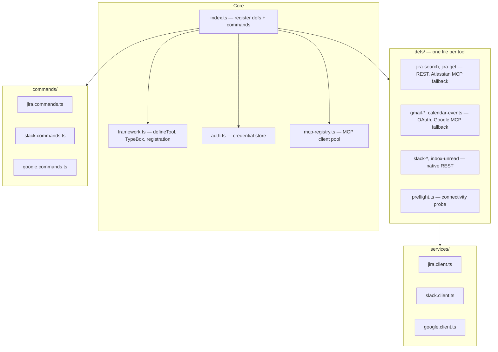
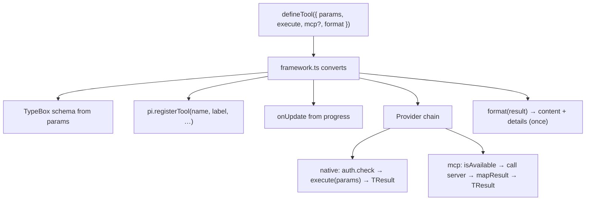

# Tool Integrations

Declarative tool definitions for Jira, Slack, Gmail, and Calendar.
Each tool is a single file exporting a `defineTool()` object.
The framework handles registration, provider chain wiring, and formatting.

## Structure

`packages/pi-tools/src/` layout:



## Adding a New Tool

Create one file in `defs/`, add its import to `index.ts`:

```typescript
// defs/my-tool.ts
import { defineTool } from "../framework.js";

export default defineTool({
  name: "my-tool",
  label: "My Tool",
  description: "Does something useful",
  params: { query: "string" },
  progress: (p) => `Running: ${p.query}`,

  async execute(p) {
    const data = await callMyApi(p.query);
    return data;
  },

  // Optional MCP fallback — omit if no MCP server
  mcp: {
    server: "my-server",
    tool: "my_tool",
    mapParams: (p) => ({ q: p.query }),
    mapResult: (raw) => raw,
  },

  format(result) {
    return { text: `Found ${result.length} items`, details: { result } };
  },
});
```

That's it. ~25 lines for a complete tool.

## How It Works



Both `execute()` and `mcp.mapResult()` return the same domain type.
`format()` is called once, regardless of which provider succeeded.
No duplicate formatting.

## Error Handling

When all providers fail:
```
[jira-search] all 2 providers failed:
  • native: Jira API error (401): Unauthorized
  • mcp:atlassian/searchJiraIssuesUsingJql: MCP server exited
```

## Setup

```bash
/jira-setup        # Atlassian email + API token
/jira-status
/slack-setup       # Slack token (xoxp- or xoxb-)
/slack-status
/google-setup      # OAuth2 or handoff mode
/google-status
```
