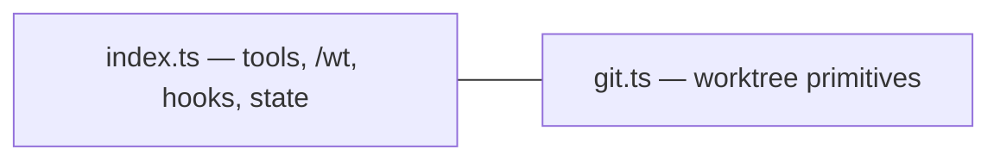

# worktree

Pi extension for managing git worktrees — work on multiple things concurrently in a single repository.

## Why

Git worktrees let you check out multiple branches simultaneously, each in its own directory. This extension makes worktrees first-class in pi: the LLM can create, inspect, execute in, merge, and PR worktrees — and you can do the same via `/wt` commands without leaving the conversation.

## Quick start

```
/wt create auth-refactor           # create worktree + branch wt/auth-refactor
/wt create fix-bug main            # branch off main instead of current branch
/wt status                         # see all worktrees
/wt pr auth-refactor --draft       # push + open draft PR
/wt merge auth-refactor            # merge back into base, clean up
/wt cleanup                        # remove all worktrees
```

## Tools

The LLM has access to these tools:

| Tool | Description |
|------|-------------|
| `wt_create` | Create a worktree with its own branch for isolated work |
| `wt_list` | List all active worktrees with branch, path, status |
| `wt_status` | Detailed status: uncommitted changes, ahead/behind, diffstat |
| `wt_merge` | Merge a worktree's branch back and clean up |
| `wt_remove` | Remove a worktree without merging |
| `wt_exec` | Run a shell command inside a worktree's directory |
| `wt_pr` | Push a worktree's branch and open/update a PR via `gh` |

## `/wt` command

| Subcommand | Action |
|---|---|
| `create <name> [base]` | Create worktree + branch `wt/<name>` from base |
| `list` or (empty) | List active worktrees |
| `status [name]` | Status summary (all or specific) |
| `merge <name> [into]` | Merge branch into base, remove worktree |
| `remove <name>` | Remove worktree (confirms if dirty) |
| `pr <name> [--draft]` | Push + open/update PR |
| `cleanup` | Remove all worktrees |
| `help` | Show usage |

## How it works

- **Worktree directory:** `.worktrees/<name>` (relative to git root, auto-added to `.gitignore`)
- **Branch naming:** `wt/<name>` — all branches prefixed to avoid collisions
- **State tracking:** Worktree metadata (base branch, creation time) persisted in pi session state — survives restarts
- **Reconciliation:** On session start, state is reconciled with `git worktree list` to detect externally added/removed worktrees
- **Status bar:** Shows `🌳 N worktrees` when worktrees are active
- **Context injection:** Active worktrees listed in the system prompt so the LLM knows about them

## Using with subagents

Each worktree is an isolated working directory. To delegate work to a worktree via subagent, pass the `cwd` parameter:

```
subagent({ agent: "phase-code", task: "...", cwd: "/path/to/repo/.worktrees/auth-refactor" })
```

For parallel work across multiple worktrees:

```
subagent({ tasks: [
  { agent: "phase-code", task: "Task A brief", cwd: ".worktrees/task-a" },
  { agent: "phase-code", task: "Task B brief", cwd: ".worktrees/task-b" },
]})
```

## Safety

- **Name validation:** Alphanumeric + hyphens/dots/underscores only
- **Branch collision:** Refuses to create if branch already exists
- **Dirty worktree:** `merge` and `remove` warn/block on uncommitted changes
- **Merge conflicts:** Aborts the merge cleanly and reports conflicting files
- **Cleanup confirmation:** `/wt cleanup` always confirms before removing
- **`.gitignore`:** `.worktrees/` automatically added on first worktree creation

## Architecture



This package does not import other extensions at build time; it pairs with the `subagent` tool (same repo, `packages/pi-subagent`) when you pass a worktree path as `cwd`. Works in any git repository.
